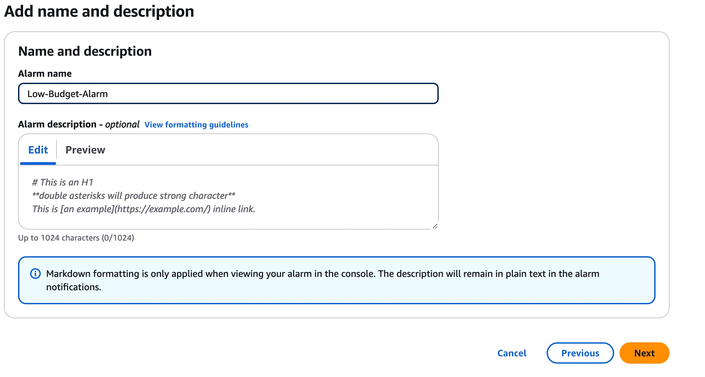

> # AWS Security

##

```
Objective: Create AWS account, set billing alarm, create 2 IAM groups (admin-developer), admin group has admin permissions, developer group only access to ec2, create admin-1 user with console access only and enable MFA & admin-2-prog user with cli access only and list all users and groups using commands, create dev-user with programmatic and console access and try to access EC2 and S3 from dev user.
```

> ### 1- First you have to create AWS Account (skip this step if you already have one)

> ### 2- We will Set Billing alarm by going to CloudWatch then select Billing under Alarm Section


> ### Press Create Alarm


     Step 1 : Specify metric and conditions


    Step 2 : Configure actions


    Step 3 : Add name and description



    Step 4 : Preview and create


##

> ### Now we will create 2 IAM Groups (admin-developer) admin group has admin permissions, developer group only access to ec2

    I will use AWS CLI for creating IAM groups and users
    so let's start by Configuring AWS CLI by typing in terminal:

    # Aws configure --profile <your profile name / username>


> ### 1. First, let's create the IAM groups:

    # Create admin group

      aws iam create-group --group-name admins

    # Create developer group

      aws iam create-group --group-name developer

    # Attach AdministratorAccess policy to admin group

      aws iam attach-group-policy --group-name admins --policy-arn arn:aws:iam::aws:policy/AdministratorAccess

    # Attach AmazonEC2FullAccess policy to developer group

      aws iam attach-group-policy --group-name developer --policy-arn arn:aws:iam::aws:policy/AmazonEC2FullAccess

> ### 2. Create admin-1 user (console access only):

    # Create user
      aws iam create-user --user-name admin-1

    # Create console password
       aws iam create-login-profile --user-name admin-1 --password YourStrongPassword123! --password-reset-required

    # Add user to admin group

      aws iam add-user-to-group --group-name admins --user-name admin-1

    # Enable MFA (Virtual MFA device)

    aws iam enable-mfa-device --user-name admin-1 --serial-number arn:aws:iam::ACCOUNT-ID:mfa/admin-1 --authentication-code-1 123456 --authentication-code-2 789012

> ### 3. Create admin-2-cli user (CLI access only):

    # Create user
      aws iam create-user --user-name admin-2-cli

    # Create access key
      aws iam create-access-key --user-name admin-2-cli

    # Add user to admin group

      aws iam add-user-to-group --group-name admin-developer --user-name admin-2-cli

> ### 4. Create dev-user (both console and programmatic access):

    # Create user
      aws iam create-user --user-name dev-user

    # Create console password
      aws iam create-login-profile --user-name dev-user --password YourStrongPassword123! --password-reset-required

    # Create access key
      aws iam create-access-key --user-name dev-user

    # Add user to developer group
      aws iam add-user-to-group --group-name developer --user-name dev-user

> ### 5. List all users and groups:

    # List all users
      aws iam list-users

    # List all groups
      aws iam list-groups

    # List users in admin-developer group
      aws iam get-group --group-name admin-developer

    # List users in developer group
      aws iam get-group --group-name developer

> ### 6. Testing dev-user access:

    To test the dev-user access, you'll need to:

    1. Configure AWS CLI with dev-user credentials:

       aws configure --profile dev-user
    #  Enter the access key and secret key when prompted

    2. Try to access EC2 (should work):

       aws ec2 describe-instances --profile dev-user


    3. Try to access S3 (should fail):

       aws s3 ls --profile dev-user


