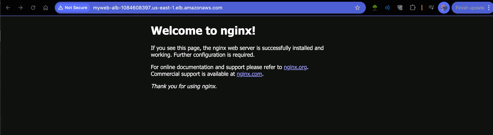

<div align="center">

<span style="color: orange; font-weight: bold; font-size: 35px;">Create AWS Load Balancer</span>

</div>

<h3>Objective: create VPC with 2 public subnets, launch 2 EC2s with Nginx and Apache installed using user data, create and configure a Load Balancer to access the 2 Web servers.</h3>

##

> ## Step 1: Create VPC and Networking Components

    1. Go to VPC Dashboard
            - Click "Create VPC"
            - Choose "VPC and more" (VPC with subnets, etc.)
            - Configure:
                   * Name tag: MyWebVPC

                   * IPv4 CIDR: 10.0.0.0/16

                   * Number of Availability Zones: 2

                   * Number of public subnets: 2

                   * Leave other settings as default

            - Click "Create VPC"

> ## Step 2: Create Security Groups

    1. Go to EC2 Dashboard → Security Groups:

    2. Create Security Group for EC2 instances:

           - Name: WebServer-SG
           - Description: Security group for web servers
           - VPC: Select your created VPC
           - Inbound rules:
                       - HTTP (80) from anywhere (0.0.0.0/0)

                       - SSH (22) from your IP

           - Click "Create security group"

    3. Create Security Group for ALB:

           - Name: ALB-SG
           - Description: Security group for Application Load Balancer
           - VPC: Select your created VPC
           - Inbound rules:

                        - HTTP (80) from anywhere (0.0.0.0/0)

           - Click "Create security group"

> ## Step 3: Launch EC2 Instances

```
    1. Go to EC2 Dashboard → Instances → Launch Instance
    2. For Nginx Server:

        -  Name: Nginx-Server
        -  AMI: Amazon Linux 2023
        -  Instance type: t2.micro
        -  Key pair: Create or select existing
        -  Network settings:

                - Select your VPC
                - Choose Public Subnet 1
                - Auto-assign public IP: Enable
                - Select WebServer-SG

        - User data (paste in the Advanced Details):

            #!/bin/bash
            dnf update -y
            dnf install nginx -y
            systemctl start nginx
            systemctl enable nginx
            echo "<h1>Hello from Nginx Server</h1>" >
            /usr/share/nginx html/index.html
```


```

    3. For Apache Server:

         Name: Apache-Server
         AMI: Amazon Linux 2023
         Instance type: t2.micro
         Key pair: Same as Nginx server
         Network settings:

                - Select your VPC
                - Choose Public Subnet 2
                - Auto-assign public IP: Enable
                - Select WebServer-SG

        - User data:

            #!/bin/bash
            dnf update -y
            dnf install httpd -y
            systemctl start httpd
            systemctl enable httpd
            echo "<h1>Hello from Apache Server</h1>" >
            /var/www/html/index.html

```


> ## Step 4: Create Application Load Balancer

```
1. Go to EC2 Dashboard → Load Balancers → Create Load Balancer
2. Choose "Application Load Balancer"
3. Basic Configuration:

       - Name: MyWeb-ALB
       - Scheme: Internet-facing
       - IP address type: IPv4

4. Network Mapping:

       - VPC: Select your VPC
       - Mappings: Select both public subnets

5. Security Groups:
       - Select ALB-SG

6. Listeners and Routing:

       - Create Target Group:

           - Choose "Instances"
           - Name: MyWeb-TG
           - Protocol: HTTP
           - Port: 80
           - VPC: Select your VPC
           - Health check path: /
           - Advanced health check settings: Leave as default
           - Register both EC2 instances as targets
           - Click "Include as pending below"

7. Review and Create:

        - Review all settings
        - Click "Create load balancer"

```

> ## Step 5: Verify Setup

```
1. Wait a few minutes for all components to initialize
2. Go to Load Balancers
3. Copy the DNS name of your ALB
4. Paste it in a web browser
5. Refresh multiple times to see responses from both servers
```

<div align="center">

<span style="color: green; font-weight: bold; font-size: 25px;">It Works!!</span>

</div>



<div align="center">

<span style="color: yellow; font-weight: bold; font-size: 30px;">!!!VERY IMPORTANT!!!</span>

</div>

```
1. Ensure all resources are in the same region

2. Both instances should pass health checks in the target group

3. The EC2 instances must be in public subnets with auto-assign public IP enabled

4. The security groups must be properly configured to allow traffic
```
