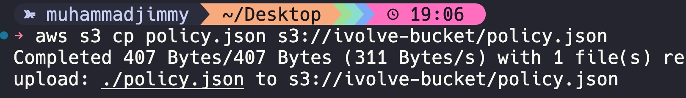
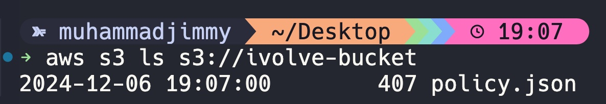

<h1>SDK and CLI Interactions</h1>

### Objective: Use the AWS CLI to Create an S3 bucket, configure permissions, and upload/download files to/from the bucket. Enable versioning and logging for the bucket.

> ## 1. First, create an S3 bucket:

```
aws s3api create-bucket \
    --bucket my-example-bucket \
    --region us-east-1

```

> ## 2. Enable versioning on the bucket:

```
aws s3api put-bucket-versioning \
    --bucket my-example-bucket \
    --versioning-configuration Status=Enabled

```

> ## 3. Set block public acls to false

```
aws s3api put-public-access-block --bucket ivolve-bucket --public-access-block-configuration BlockPublicAcls=false

```

> ## 4. Set a bucket policy to ensure proper access

```
aws s3api put-bucket-policy \
    --bucket ivolve-bucket \
    --policy '{
    "Version": "2012-10-17",
    "Statement": [
        {
            "Effect": "Allow",
            "Principal": "*",
            "Action": "s3:GetObject",
            "Resource": "arn:aws:s3:::ivolve-bucket/*"
        },
        {
            "Effect": "Allow",
            "Principal": "*",
            "Action": "s3:PutObject",
            "Resource": "arn:aws:s3:::ivolve-bucket/*"
        }
    ]
}'

```

> ## 5. Enable logging for the original bucket:

```
aws s3api put-bucket-logging --bucket ivolve-bucket --bucket-logging-status '{
    "LoggingEnabled": {
        "TargetBucket": "ivolve-bucket",
        "TargetPrefix": "logs/"
    }
}'
```

> ## 6. Upload a file to the bucket:

    Example:
    aws s3 cp policy.json s3://ivolve-bucket/



> ## 7. Download a file from the bucket:

    Example:
    aws s3 cp s3://ivolve-bucket/policy.json ./

> ## 8. List objects in the bucket:

    Example:
    aws s3 ls s3://ivolve-bucket


