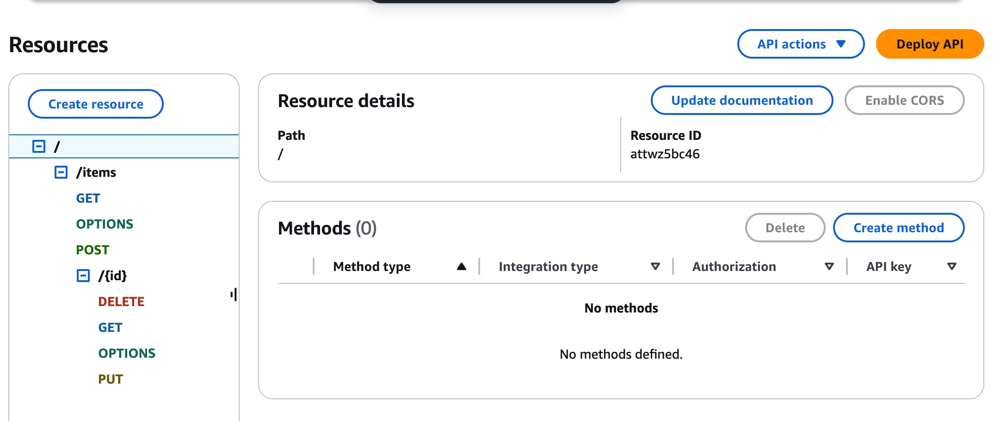
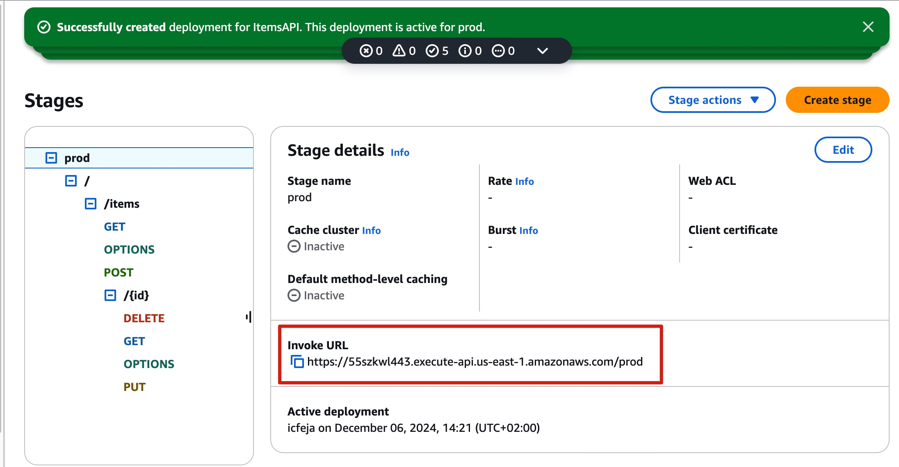
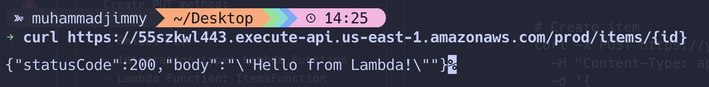

<h1>Serverless Application Development
</h1>
<h3>Objective: Build a serverless application using AWS Lambda, API Gateway, and DynamoDB.</h3>

> ## 1. First, Create the DynamoDB Table:

    1. Go to AWS DynamoDB Console
    2. Click "Create table"
    3. Enter table details:
        - Table name: Items
        - Partition key: id (String)
    4. Settings:
        - Keep default settings (On-demand or Provisioned capacity)
    5. Click "Create table"

##

> ## 2. Create the Lambda Function:

    1. Go to AWS Lambda Console
    2. Click "Create function"
    3. Choose:
        - Author from scratch
        - Function name: ItemsFunction
        - Runtime: Node.js 20.x
        - Architecture: x86_64
    4. Click "Create function"

##

> ## 3. Configure Lambda Permissions:

```
1. In the Lambda function page
2. Go to "Configuration" tab
3. Click on "Permissions"
4. Click on the execution role
5. In IAM Console, add policy:
   - Click "Add permissions" -> "Create inline policy"
   - Choose JSON and paste:
   {
       "Version": "2012-10-17",
       "Statement": [
           {
               "Effect": "Allow",
               "Action": [
                   "dynamodb:PutItem",
                   "dynamodb:GetItem",
                   "dynamodb:UpdateItem",
                   "dynamodb:DeleteItem",
                   "dynamodb:Scan"
               ],
               "Resource": "arn:aws:dynamodb:REGION:ACCOUNT-ID:table/Items"
           }
       ]
   }
   - Replace REGION and ACCOUNT-ID with your values
6. Click "Review policy"
7. Name it "ItemsFunctionDynamoDBPolicy"
8. Click "Create policy"

```

> ## 4. Add Environment Variable to Lambda:

    1. Go back to Lambda function
    2. Go to "Configuration" tab
    3. Click on "Environment variables"
    4. Click "Edit"
    5. Add variable:
        - Key: TABLE_NAME
        - Value: Items
    6. Click "Save"

> ## 5. Add Lambda Function Code:

    1. Go to "Code" tab
    2. Delete existing code in index.js
    3. Paste this code (this is the same code as provided earlier):

```
const AWS = require('aws-sdk');
const dynamodb = new AWS.DynamoDB.DocumentClient();
const TABLE_NAME = process.env.TABLE_NAME;

// Input validation helper
const validateItem = (item) => {
    if (!item.name || typeof item.name !== 'string') {
        throw new Error('Item name is required and must be a string');
    }
    if (!item.description || typeof item.description !== 'string') {
        throw new Error('Item description is required and must be a string');
    }
};

// Error response helper
const errorResponse = (statusCode, message) => ({
    statusCode,
    body: JSON.stringify({ error: message })
});

// Success response helper
const successResponse = (statusCode, data) => ({
    statusCode,
    body: JSON.stringify(data)
});

exports.handler = async (event) => {
    console.log('Event:', JSON.stringify(event, null, 2));

    try {
        const { httpMethod, pathParameters, body } = event;

        switch (httpMethod) {
            case 'GET':
                if (pathParameters && pathParameters.id) {
                    const getResult = await dynamodb.get({
                        TableName: TABLE_NAME,
                        Key: { id: pathParameters.id }
                    }).promise();

                    if (!getResult.Item) {
                        return errorResponse(404, 'Item not found');
                    }

                    return successResponse(200, getResult.Item);
                } else {
                    const scanResult = await dynamodb.scan({
                        TableName: TABLE_NAME
                    }).promise();

                    return successResponse(200, scanResult.Items);
                }

            case 'POST':
                try {
                    const item = JSON.parse(body);
                    validateItem(item);

                    const newItem = {
                        id: Date.now().toString(),
                        createdAt: new Date().toISOString(),
                        ...item
                    };

                    await dynamodb.put({
                        TableName: TABLE_NAME,
                        Item: newItem
                    }).promise();

                    return successResponse(201, newItem);
                } catch (error) {
                    return errorResponse(400, error.message);
                }

            case 'PUT':
                try {
                    if (!pathParameters || !pathParameters.id) {
                        return errorResponse(400, 'Item ID is required');
                    }

                    const updateItem = JSON.parse(body);
                    validateItem(updateItem);

                    const updateResult = await dynamodb.update({
                        TableName: TABLE_NAME,
                        Key: { id: pathParameters.id },
                        UpdateExpression: 'set #name = :name, description = :description, updatedAt = :updatedAt',
                        ExpressionAttributeNames: {
                            '#name': 'name'
                        },
                        ExpressionAttributeValues: {
                            ':name': updateItem.name,
                            ':description': updateItem.description,
                            ':updatedAt': new Date().toISOString()
                        },
                        ReturnValues: 'ALL_NEW'
                    }).promise();

                    return successResponse(200, updateResult.Attributes);
                } catch (error) {
                    return errorResponse(400, error.message);
                }

            case 'DELETE':
                if (!pathParameters || !pathParameters.id) {
                    return errorResponse(400, 'Item ID is required');
                }

                await dynamodb.delete({
                    TableName: TABLE_NAME,
                    Key: { id: pathParameters.id }
                }).promise();

                return successResponse(200, { message: 'Item deleted successfully' });

            default:
                return errorResponse(400, 'Unsupported HTTP method');
        }
    } catch (error) {
        console.error('Error:', error);
        return errorResponse(500, 'Internal server error');
    }
};

```

> ## 6. Create API Gateway:

    1. Go to API Gateway Console
    2. Click "Create API"
    3. Choose "REST API" (not private)
    4. Click "Build"
    5. Create new API:
        - API name: ItemsAPI
        - Endpoint Type: Regional
    6. Click "Create API"

##

> ## 7. Create API Resources and Methods:

```
1. In the API Gateway console:
2. Click "Create Resource":
   - Resource Name: items
   - Resource Path: /items
3. Click "Create Resource"

4. For the /items resource, create methods:
   Create GET method:
   - Click "Create Method"
   - Select GET
   - Integration type: Lambda Function
   - Lambda Function: ItemsFunction
   - Click "Save"

   Create POST method:
   - Click "Create Method"
   - Select POST
   - Integration type: Lambda Function
   - Lambda Function: ItemsFunction
   - Click "Save"

5. Create a child resource for /items/{id}:
   - Select /items resource
   - Click "Create Resource"
   - Resource Name: item
   - Resource Path: {id}
   - Enable API Gateway CORS: Yes
   - Click "Create Resource"

6. For the /items/{id} resource, create methods:
   Create GET method:
   - Click "Create Method"
   - Select GET
   - Integration type: Lambda Function
   - Lambda Function: ItemsFunction
   - Click "Save"

   Create PUT method:
   - Click "Create Method"
   - Select PUT
   - Integration type: Lambda Function
   - Lambda Function: ItemsFunction
   - Click "Save"

   Create DELETE method:
   - Click "Create Method"
   - Select DELETE
   - Integration type: Lambda Function
   - Lambda Function: ItemsFunction
   - Click "Save"

```



> ## 8. Deploy the API:

    1. Click "Deploy API"
    2. Create new stage:
        - Stage name: prod
    3. Click "Deploy"
    4. Note the Invoke URL provided



> ## 9. Test the API

```
1. Use Postman or curl to test the endpoints:

# Create item
curl -X POST https://your-api-url/prod/items \
  -H "Content-Type: application/json" \
  -d '{
    "name": "Test Item",
    "description": "This is a test item"
  }'

# Get all items
curl https://your-api-url/prod/items

# Get specific item
curl https://your-api-url/prod/items/{id}

# Update item
curl -X PUT https://your-api-url/prod/items/{id} \
  -H "Content-Type: application/json" \
  -d '{
    "name": "Updated Item",
    "description": "This is an updated description"
  }'

# Delete item
curl -X DELETE https://your-api-url/prod/items/{id}

```

<h3>Here's a simple API TEST Using Curl</h3>


