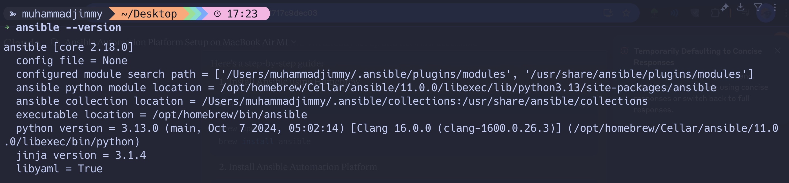
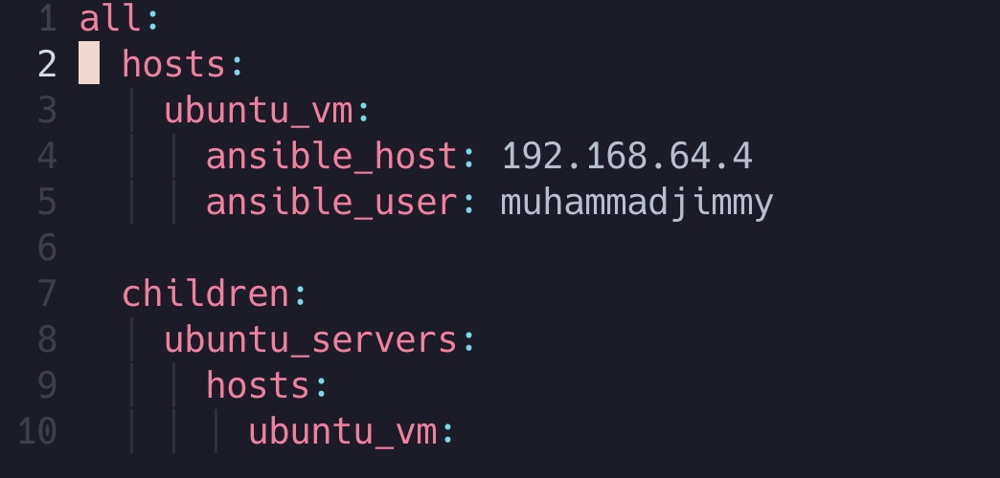

## Objective: Install and configure Ansible Automation Platform on control nodes, create inventories of a managed host, and then perform ad-hoc commands to check functionality.

> 1- you have to install ansible on your master node

    brew install ansible (For MacOS)
    sudo apt install ansible (for linux or use your pkg manager to install ansible)

> 2- let's Verify Ansible Installation

> 3- Create an Inventory File

> 4- Generate SSH Key (if not already done)

    ssh-keygen -t rsa

> 5- Copy SSH Key to Ubuntu VM

    ssh-copy-id <YOUR_VM_USERNAME>@<VM_IP_ADDRESS>

> 6- Running Simple ad-hoc command

    ansible -i inventory.yaml ubuntu_servers -a "uptime"

