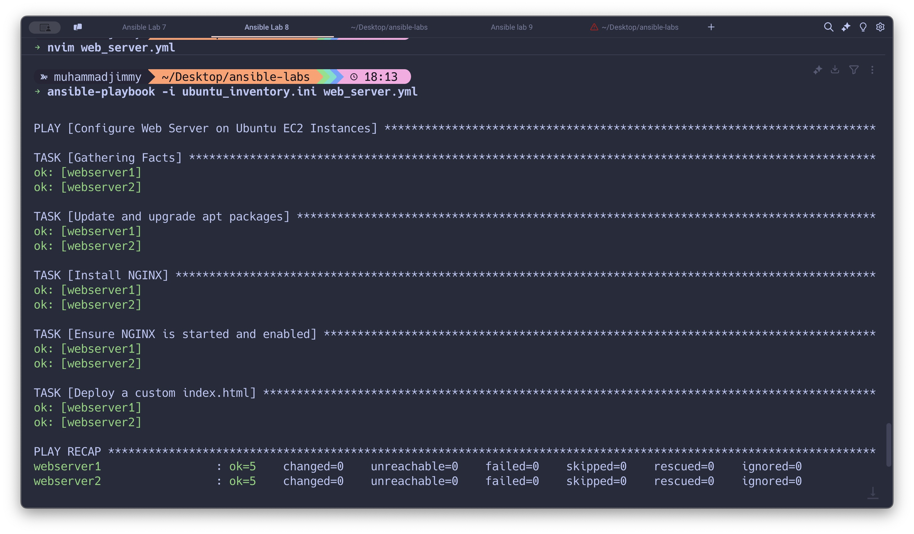

# Objective: Write an Ansible playbook to automate the configuration of a web server.

> 1- You must install Ansible on Your Master Node

    brew install ansible (mac Users)
    sudo apt install ansible -y (linux)

##

> 2- Ensure SSH access is set up

##

> 3- Create inventory file

```
[webservers]
 webserver1 ansible_host=54.87.59.244 ansible_user=ubuntu ansible_ssh_private_key_file=/Users/muhammadjimmy/Desktop/ansible-labs/ansible-ec2.pem
 webserver2 ansible_host=52.91.15.184 ansible_user=ubuntu ansible_ssh_private_key_file=/Users/muhammadjimmy/Desktop/ansible-labs/ansible-ec2.pem
[webservers:vars]
 ansible_python_interpreter=/usr/bin/python3
```

##

> 4- Create Ansible playbook

```
---
- name: Configure Web Server on Ubuntu EC2 Instances
  hosts: webservers
  become: yes
  tasks:
    - name: Update and upgrade apt packages
      apt:
        update_cache: yes
        upgrade: dist

    - name: Install NGINX
      apt:
        name: nginx
        state: present

    - name: Ensure NGINX is started and enabled
      service:
        name: nginx
        state: started
        enabled: yes

    - name: Deploy a custom index.html
      copy:
        content: |
          <html>
          <head>
              <title>Welcome to Your Ansible Automated Web Server!</title>
          </head>
          <body>
              <h1>Hello from Ansible!</h1>
          </body>
          </html>
        dest: /var/www/html/index.html
        owner: www-data
        group: www-data
        mode: '0644'


```

##

> 5- Running the Playbook

    ansible-playbook -i ubuntu_inventory.ini web_server.yml

##


