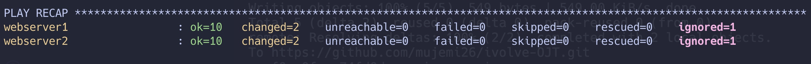

# Objective: Write an Ansible playbook to install MySQL, create ivovle database, create user with all privileges on ivolve DB. Use Ansible Vault to encrypt sensitive information such as database user password, and incorporate the encrypted data into an Ansible playbook

> 1- First, let's create an Ansible Vault for our sensitive information:

    ansible-vault create vault vault.yml

```
mysql_root_password: 'StrongRootPassword123!'
mysql_ivolve_db_user: 'ivolve_user'
mysql_ivolve_db_password: 'SecureUserPassword456!'

```

> 2- Create MySQL Playbook

     vim mysql_book.yml

```
---
- hosts: webservers
  become: yes
  vars_files:
    - group_vars/mysql_vault.yml

  tasks:
    - name: Update apt cache
      apt:
        update_cache: yes
        cache_valid_time: 3600

    - name: Install required system packages
      apt:
        name:
          - wget
          - curl
          - software-properties-common
          - python3-pip
          - python3-dev
          - default-libmysqlclient-dev
          - build-essential
          - python3-pymysql  # System-packaged Python MySQL library
          - python3-mysqldb  # Alternative MySQL library
        state: present

    - name: Install MySQL Server
      apt:
        name:
          - mysql-server
          - mysql-client
        state: present

    - name: Ensure MySQL service is started
      systemd:
        name: mysql
        state: started
        enabled: yes

    - name: Set root user authentication method
      command: >
        mysql -e "ALTER USER 'root'@'localhost' IDENTIFIED WITH mysql_native_password BY '{{ mysql_root_password }}';"
      ignore_errors: yes

    - name: Create Ivolve Database
      community.mysql.mysql_db:
        name: ivolve_db
        state: present
        login_user: root
        login_password: "{{ mysql_root_password }}"

    - name: Create MySQL User with All Privileges
      community.mysql.mysql_user:
        name: "{{ mysql_ivolve_db_user }}"
        password: "{{ mysql_ivolve_db_password }}"
        priv: 'ivolve_db.*:ALL'
        state: present
        login_user: root
        login_password: "{{ mysql_root_password }}"
        host: '%'

    - name: Configure MySQL to accept remote connections
      lineinfile:
        path: /etc/mysql/mysql.conf.d/mysqld.cnf
        regexp: '^bind-address'
        line: 'bind-address = 0.0.0.0'
        backup: yes
      notify: Restart MySQL

    - name: Flush Privileges
      command: >
        mysql -u root -p"{{ mysql_root_password }}" -e "FLUSH PRIVILEGES;"
      ignore_errors: yes

  handlers:
    - name: Restart MySQL
      systemd:
        name: mysql
        state: restarted
```

##

> 3- Create inventory

```
[webservers]
webserver1 ansible_host=54.87.59.244 ansible_user=ubuntu ansible_ssh_private_key_file=/Users/muhammadjimmy/Desktop/ansible-labs/ansible-ec2.pem
webserver2 ansible_host=52.91.15.184 ansible_user=ubuntu ansible_ssh_private_key_file=/Users/muhammadjimmy/Desktop/ansible-labs/ansible-ec2.pem
[webservers:vars]
ansible_python_interpreter=/usr/bin/python3
```

##

> 4- Run the playbook with vault password

    ansible-playbook -i ubuntu_inventory.ini mysql_book.yml --ask-vault-pass

##



## !!!it Works!!!
