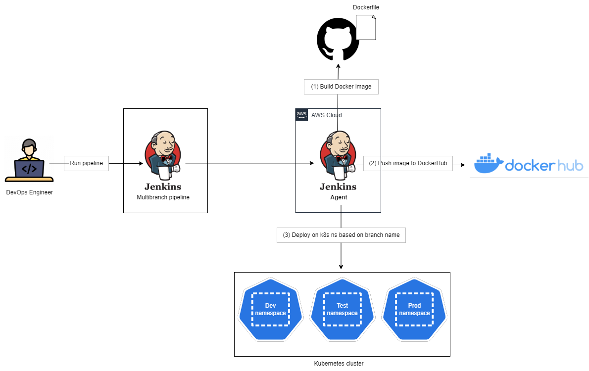
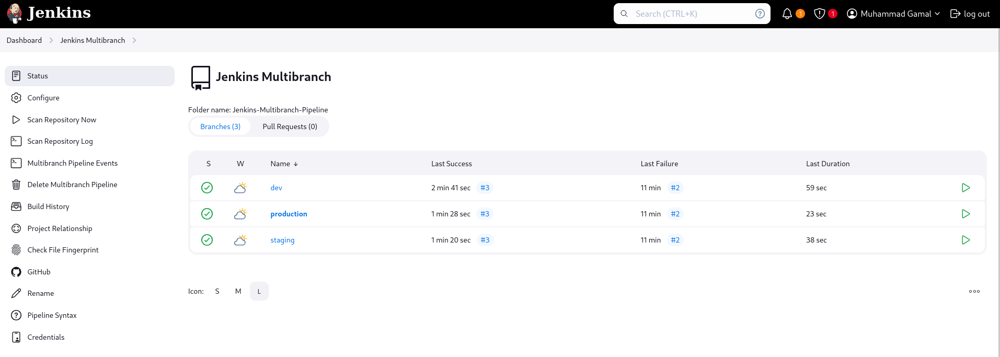
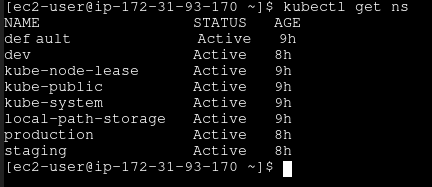
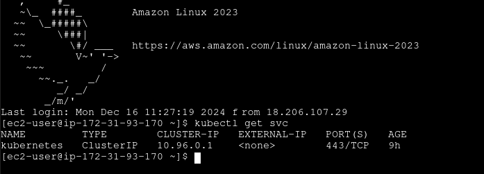
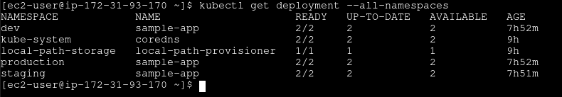
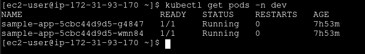

# Multi-Branch Pipeline for Containerized Application Deployment

<pre style="font-size: 14px">This repository contains a Jenkins pipeline configuration for automating the build, push, 
and deployment of a containerized application based on GitHub branches using Docker and Kubernetes.</pre>


<pre style="font-size: 14px">
Objectives:
    • Create 3 namespaces in you K8S environment.
    • Create a Multibranch pipeline to automate the deployment in the namespace 
      based on GitHub branch.
    • Create Jenkins slave to run this pipeline
</pre>

## Project Diagram

## Pipeline Overview

This pipeline automatically handles the following stages:
1. Code checkout
2. Docker image building
3. Docker image pushing to registry
4. Kubernetes deployment

## Prerequisites

### Jenkins Configuration
- Jenkins server with Multibranch Pipeline plugin
- Jenkins slave node labeled as 'your-node-name'
- Following Jenkins credentials configured:
  * `dockerhub-credentials`: Username/Password credential for Docker Hub
  * `kind-kubeconfig`: File credential containing Kubernetes configuration

### Required Tools
- Docker installed and running on Jenkins slave
- kubectl CLI tool installed on Jenkins slave
- Git

### Infrastructure
- Kubernetes cluster (using kind)
- Docker Hub account
- Three Kubernetes namespaces: dev, staging, production


```
# Create development namespace
    kubectl create namespace dev

# Create staging namespace
    kubectl create namespace staging

# Create production namespace
    kubectl create namespace production

# Verify namespaces were created successfully
    kubectl get namespaces

```

## Repository Branch Structure for each branch 

```
your-repo-branch/
├── Jenkinsfile
├── Dockerfile
├── deployment.yaml
├── service.yaml
└── your application files (if needed)
```


## Pipeline Stages Explained

### 1. Checkout Code
```groovy
stage('Checkout Code') {
    steps {
        checkout scm
    }
}

- Fetches the latest code from the source control

- Automatically detects the branch being built

```

### 2. Build Docker Image
```groovy
stage('Build Docker Image') {
    steps {
        script {
            def dockerImage = "mujimmy/sample-app:${env.BRANCH_NAME}"
            sh "docker build -t ${dockerImage} ."
        }
    }
}

- Builds Docker image with tag based on branch name

- Example: mujimmy/sample-app:dev for dev branch

```

### 3. Push Docker Image
```groovy
stage('Push Docker Image') {
    steps {
        withCredentials([...]) {
            script {
                def dockerImage = "mujimmy/sample-app:${env.BRANCH_NAME}"
                sh "echo $DOCKER_PASS | docker login -u $DOCKER_USER --password-stdin"
                sh "docker push ${dockerImage}"
            }
        }
    }
}

- Securely logs into Docker Hub

- Pushes the built image to Docker Hub repository

```

### 4. Deploy to Kubernetes
```groovy
stage('Deploy to Kubernetes') {
    steps {
        script {
            // Namespace selection based on branch
            // Applies Kubernetes configurations
        }
    }
}

- Selects appropriate namespace based on branch:

    dev branch → dev namespace

    staging branch → staging namespace

    production branch → production namespace

- Applies deployment and service configurations

```

## Branch Strategy
<pre style="font-size: 14px">The pipeline supports three environments:</pre>

    - Development (dev branch)

    - Staging (staging branch)

    - Production (production branch)

    Each branch deployment is isolated in its own namespace in Kubernetes.
```

```
## Required Kubernetes Files

<pre style="font-size: 18px">deployment.yaml</pre>

    - Contains Kubernetes deployment configuration
    - Should reference the Docker image dynamically

<pre style="font-size: 18px">service.yaml</pre>

    - Contains Kubernetes service configuration
    - Defines how the application is exposed

```

```
## Security Notes
    - Docker Hub credentials are securely stored in Jenkins

    - Kubernetes configuration is managed securely through Jenkins credentials

    - Each environment is isolated in its own namespace


```

```

## Compelete Jenkinsfile :

```

pipeline {
    agent {
        node{
            label 'jenkins-slave'
        }
    }

    stages {
        stage('Checkout Code') {
            steps {
                checkout scm
            }
        }

        stage('Build Docker Image') {
            steps {
                script {
                    def dockerImage = "mujimmy/sample-app:${env.BRANCH_NAME}"
                    sh "docker build -t ${dockerImage} ."
                }
            }
        }

        stage('Push Docker Image') {
            steps {
                withCredentials([usernamePassword(credentialsId: 'dockerhub-credentials', usernameVariable: 'DOCKER_USER', passwordVariable: 'DOCKER_PASS')]) {
                    script {
                        def dockerImage = "mujimmy/sample-app:${env.BRANCH_NAME}"
                        sh "echo $DOCKER_PASS | docker login -u $DOCKER_USER --password-stdin"
                        sh "docker push ${dockerImage}"
                    }
                }
            }
        }

        stage('Deploy to Kubernetes') {
            steps {
                script {
                    def namespace = ''

                    if (env.BRANCH_NAME == 'dev') {
                        namespace = 'dev'
                    } else if (env.BRANCH_NAME == 'staging') {
                        namespace = 'staging'
                    } else if (env.BRANCH_NAME == 'production') {
                        namespace = 'production'
                    }

                    withCredentials([file(credentialsId: 'kind-kubeconfig', variable: 'KUBECONFIG')]) {
                        def dockerImage = "mujimmy/sample-app:${env.BRANCH_NAME}"
                        sh "export KUBECONFIG=${KUBECONFIG}"
                        sh "kubectl apply -f deployment.yaml --namespace=${namespace}"
                        sh "kubectl apply -f service.yaml --namespace=${namespace}"
                    }
                }
            }
        }
    }
}

```


## Multi-Branch Pipeline Screen



```bash
$ Kubectl get namespaces
```


```bash
$ kubectl get svc
```


```bash
$ kubectl get deployments
```


```bash
$ kubectl get pods -n dev
```


