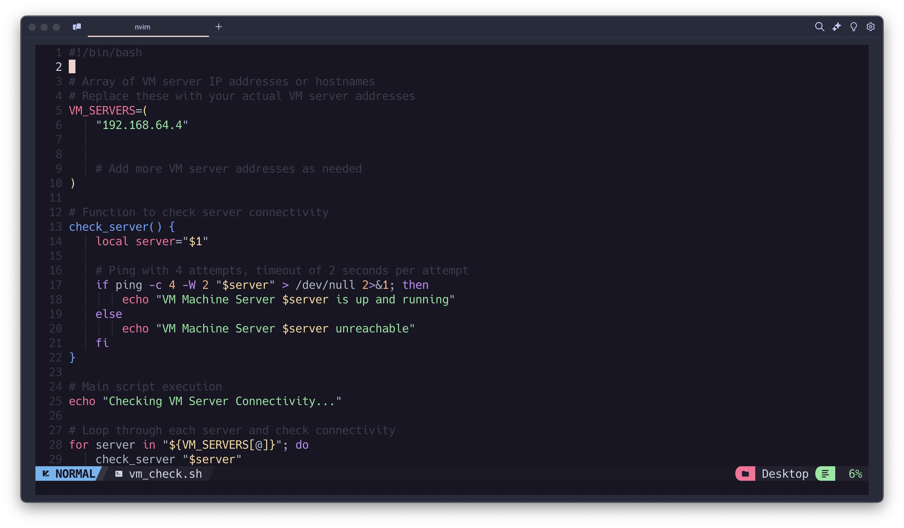

<h3>
Objective: Create a shell script to ping every server in the 172.16.17.x subnet (where x is a number between 0 and 255). If the ping succeeds, display the message “Server 172.16.17.x is up and running” If the ping fails, display the message “Server 172.16.17.x is unreachable”.
</h3>

- So need to create a bash/shell script to check the VM Machines or Servers
  

- After saving and exit we need to make the script we made to be excutable by this command
  sudo chmod +x path/to/you/script

- Now we can test the Script
  
  !!! IT Works !!!
