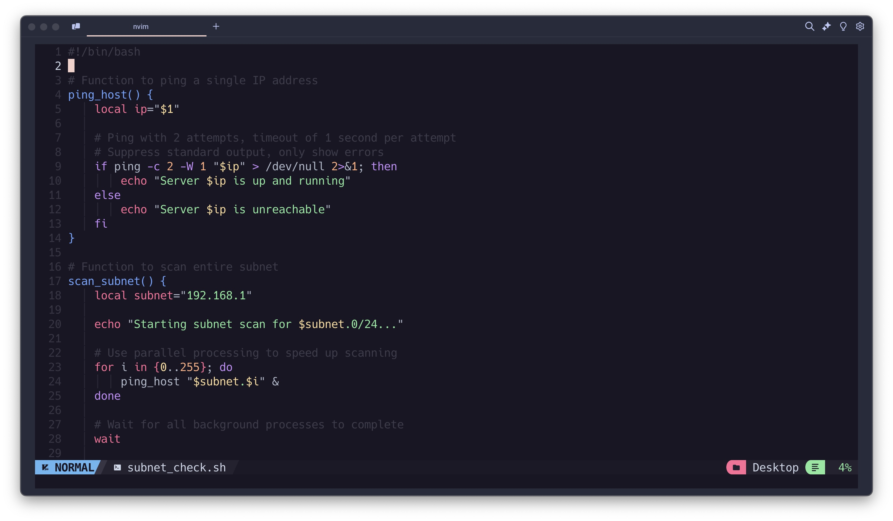
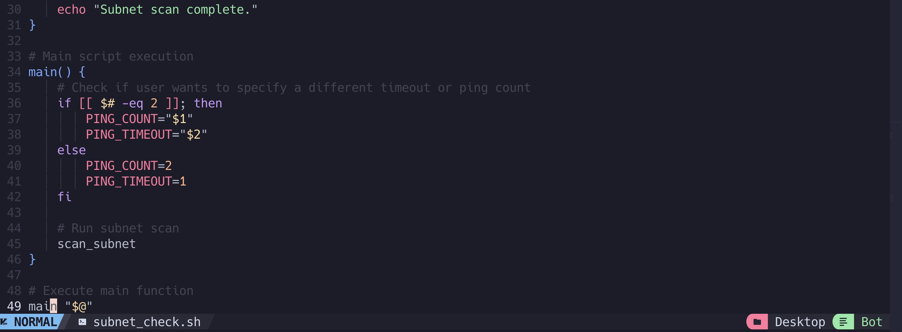
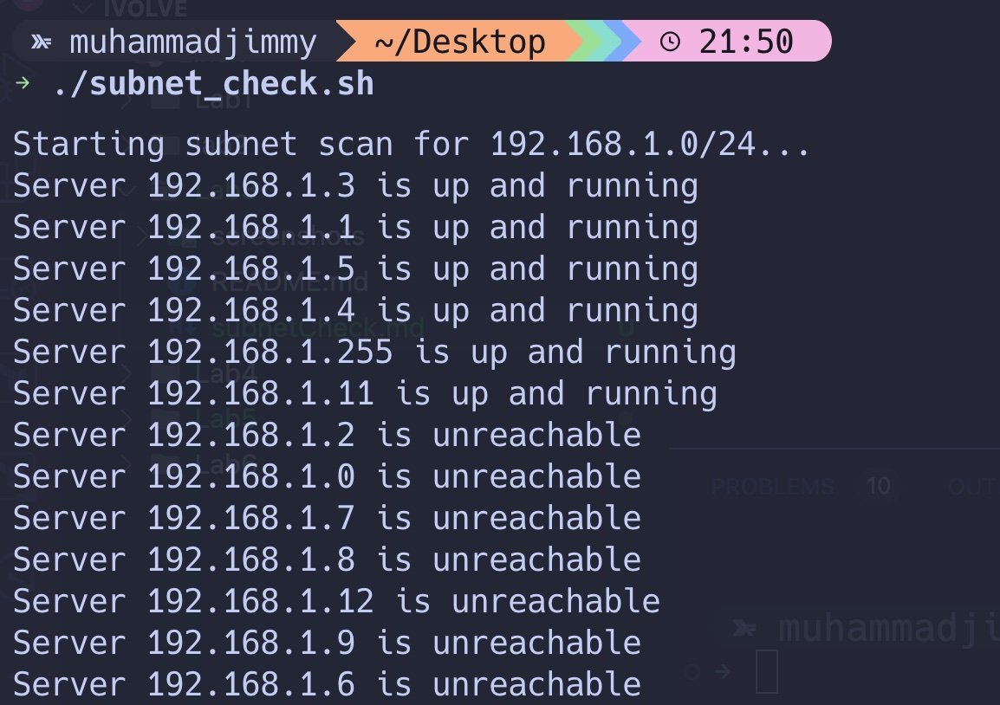

<h2>This Script Demonstrate how to check a specific Subnet to see which server or machines is up and running 
</h1>

################################################

################################################

