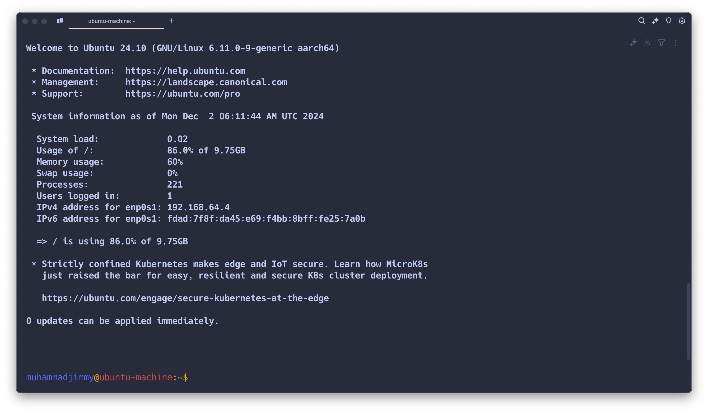

<h3>Objective: Generate public and private keys and enable SSH from your machine to another VM using the key. Configure SSH to just run ‘ssh ivolve’ without specify username, IP and key in the command.</h3>

- First we need to Generate SSH Keys on Main Machine
  

- Second Copy the Public Key to the Ubuntu VM
  

- After that we must ensure that the ( PubkeyAuthentication yes ) (AuthorizedKeysFile .ssh/authorized_keys ) is enabled or not hashed
  

- Now we need to edit the ssh config so we can ssh to the target by just typing ssh (Name_of_Target)
  

- And Now we will test to ssh by just type ssh and the name of the target we put in the ssh config
  
  
  !!! IT Works !!! we now inside the VM Machine
