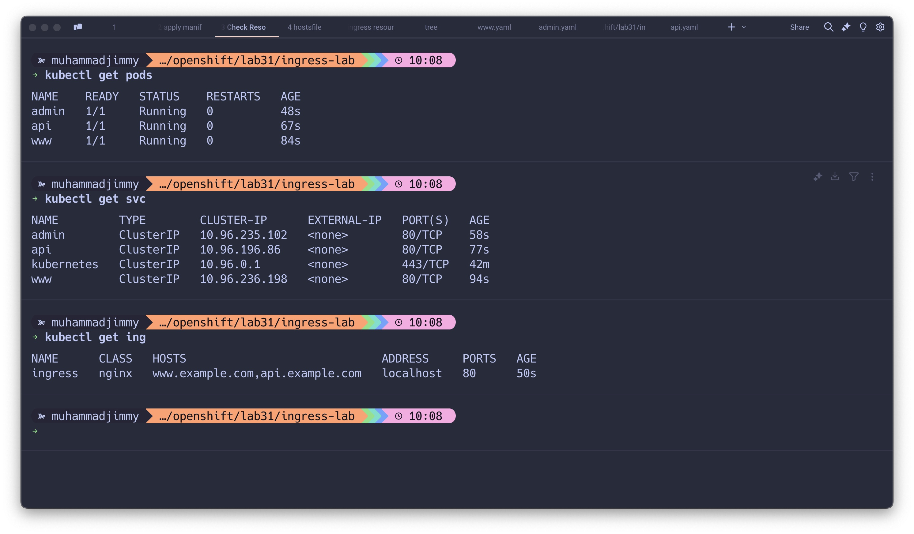
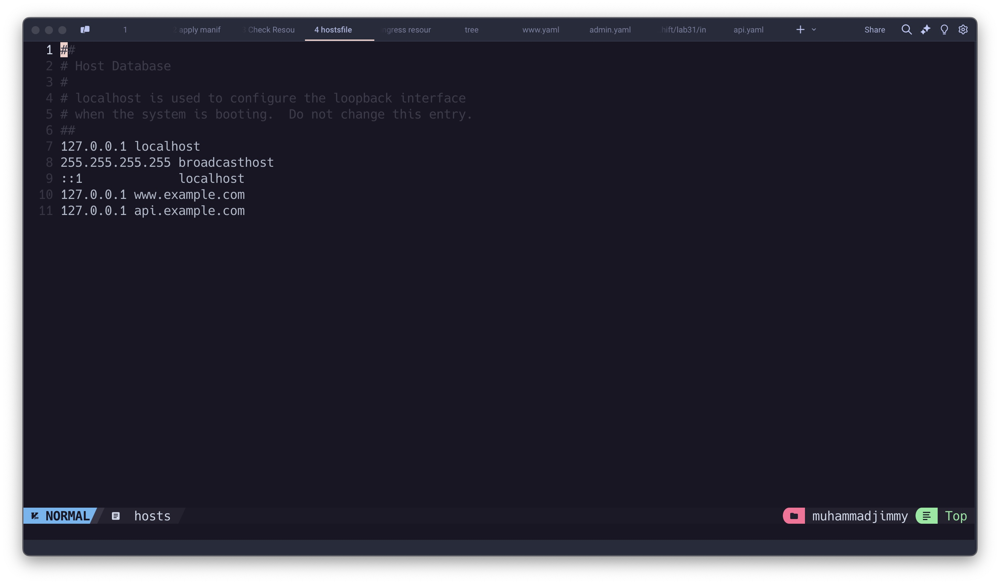
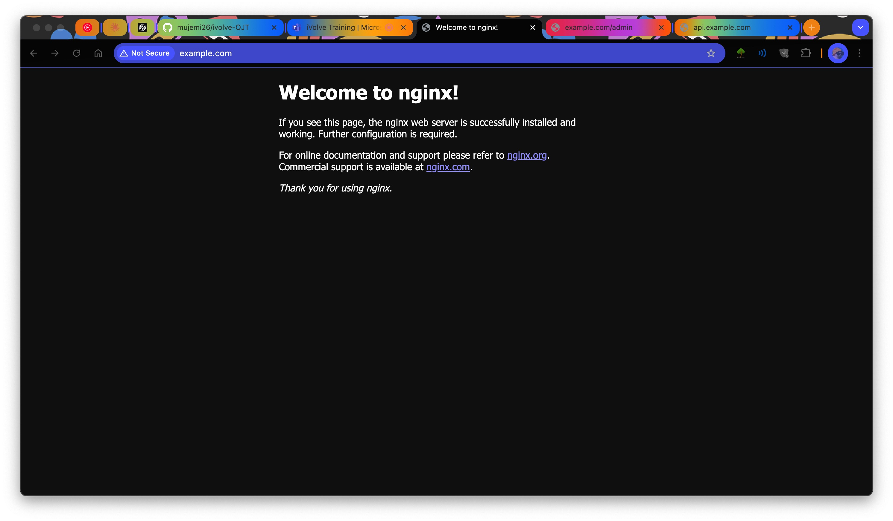
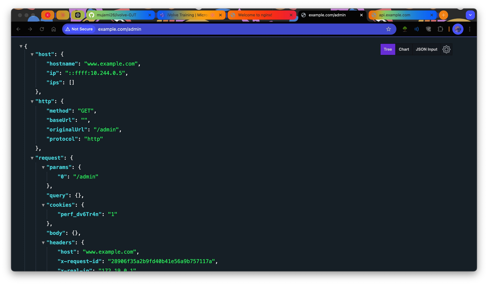
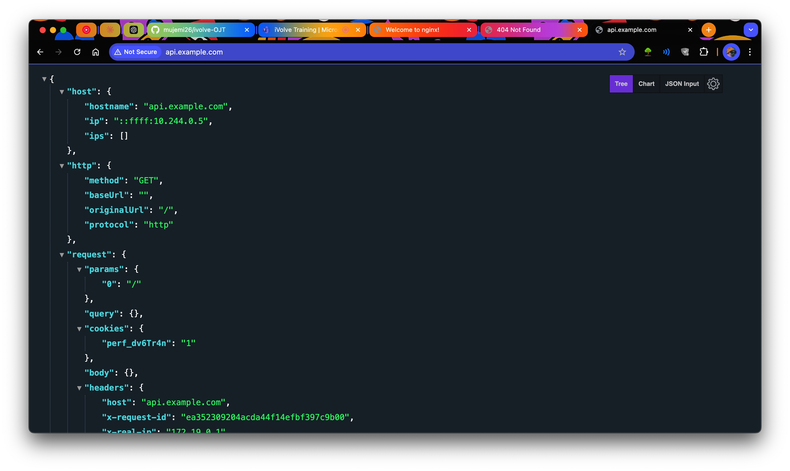

# Kubernetes Ingress with Kind & Nginx 🚀

This guide outlines the steps to deploy a microservices application using Kubernetes, Kind, and the Nginx Ingress Controller.

---

## Prerequisites 🛠️

- [Kind installed](https://kind.sigs.k8s.io/)
- Kubernetes CLI (`kubectl`) installed

---

## Steps to Deploy the Application

### 1. Install the Nginx Ingress Controller 🌐

Follow the official documentation: [Kind Ingress Setup](https://kind.sigs.k8s.io/docs/user/ingress/)

### 2. Create the Cluster 🏗️

First, delete any existing cluster:

```bash
kind delete cluster
```

Create a new cluster with a specific configuration:

```bash
cat <<EOF | kind create cluster --config=-
kind: Cluster
apiVersion: kind.x-k8s.io/v1alpha4
nodes:
- role: control-plane
  kubeadmConfigPatches:
  - |
    kind: InitConfiguration
    nodeRegistration:
      kubeletExtraArgs:
        node-labels: "ingress-ready=true"
  extraPortMappings:
  - containerPort: 80
    hostPort: 80
    protocol: TCP
  - containerPort: 443
    hostPort: 443
    protocol: TCP
EOF
```

Wait until the cluster is ready, then install the Nginx ingress controller:

```bash
kubectl apply -f https://raw.githubusercontent.com/kubernetes/ingress-nginx/main/deploy/static/provider/kind/deploy.yaml
```

Ensure the ingress controller is ready:

```bash
kubectl wait --namespace ingress-nginx \
  --for=condition=ready pod \
  --selector=app.kubernetes.io/component=controller \
  --timeout=90s
```

---

### 3. Deploy the Application 🛠️

The application consists of three services:

- **Admin**: `www.example.com/admin`
- **API**: `api.example.com`
- **Main**: `www.example.com`

#### Create the Pods and Services 🛠️

1. **www Service**

```yaml
# www.yaml
apiVersion: v1
kind: Pod
metadata:
  name: www
  labels:
    app: www
spec:
  containers:
    - name: www
      image: nginx
---
apiVersion: v1
kind: Service
metadata:
  name: www
spec:
  selector:
    app: www
  ports:
    - protocol: TCP
      port: 80
      targetPort: 80
```

2. **API Service**

```yaml
# api-pod.yaml
apiVersion: v1
kind: Pod
metadata:
  name: api
  labels:
    app: api
spec:
  containers:
    - name: api
      image: ealen/echo-server:latest
      ports:
        - containerPort: 80
---
apiVersion: v1
kind: Service
metadata:
  name: api
spec:
  selector:
    app: api
  ports:
    - protocol: TCP
      port: 80
      targetPort: 80
```

3. **Admin Service**

```yaml
# admin.yaml
apiVersion: v1
kind: Pod
metadata:
  name: admin
  labels:
    app: admin
spec:
  containers:
    - name: admin
      image: ealen/echo-server:latest
      env:
        - name: ECHO_SERVER_BASE_PATH
          value: "/admin"
      ports:
        - containerPort: 80
---
apiVersion: v1
kind: Service
metadata:
  name: admin
spec:
  selector:
    app: admin
  ports:
    - protocol: TCP
      port: 80
      targetPort: 80
```

#### Create the Ingress Resource 🌉

```yaml
# ingress.yaml
apiVersion: networking.k8s.io/v1
kind: Ingress
metadata:
  name: ingress
spec:
  ingressClassName: nginx
  rules:
    - host: www.example.com
      http:
        paths:
          - path: /
            pathType: Prefix
            backend:
              service:
                name: www
                port:
                  number: 80
          - path: /admin
            pathType: Exact
            backend:
              service:
                name: admin
                port:
                  number: 80
    - host: api.example.com
      http:
        paths:
          - path: /
            pathType: Prefix
            backend:
              service:
                name: api
                port:
                  number: 80
```

---

### 4. Apply the Manifests 📄

Deploy all resources to the cluster:

```bash
kubectl apply -f www.yaml
kubectl apply -f api-pod.yaml
kubectl apply -f admin.yaml
kubectl apply -f ingress.yaml
```

Check the resources:

```bash
kubectl get pods
kubectl get svc
kubectl get ing
```



Add the following entries to `/etc/hosts`:

```plaintext
127.0.0.1 api.example.com
127.0.0.1 www.example.com
```

---



### 5. Testing the Application 🧪

Test the application by visiting:

- `http://www.example.com`
  
- `http://www.example.com/admin`
  
- `http://api.example.com`
  

**Note:**

- `www.example.com/admin` is routed **exactly**, while `www.example.com/admin/something` is not.
  
- `api.example.com/something` is routed because it uses the **Prefix** path type.

---

We're Done for today! 🎉
