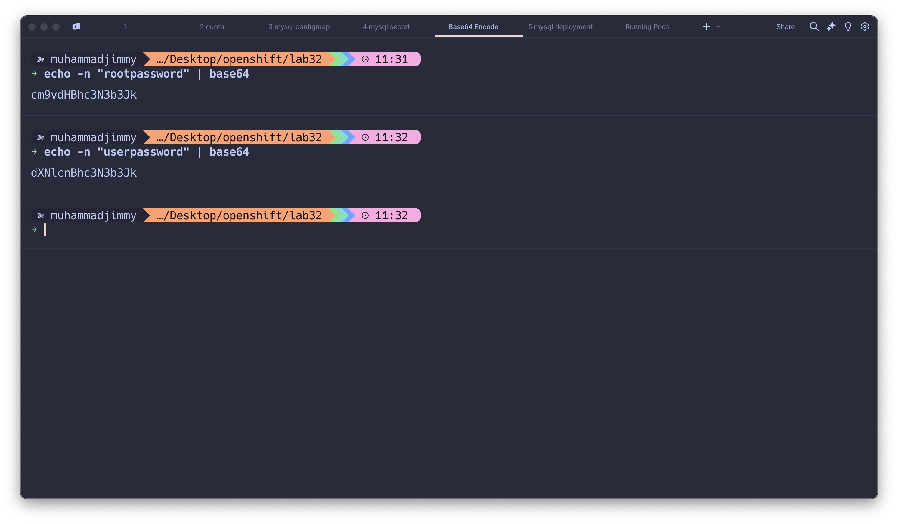

# MySQL Pod Setup in Kubernetes 🚀

This repository contains a complete guide and YAML configurations to set up a MySQL Pod in Kubernetes. The setup includes a namespace, resource quotas, ConfigMap, Secret, and a Deployment with resource constraints. Follow the steps below to get started! 💻

---

## Prerequisites 🛠️

- Kubernetes cluster up and running.
- `kubectl` CLI installed and configured.
- Basic knowledge of Kubernetes objects.

---

## Setup Steps 📝

### 1. Create a Namespace and Resource Quota 🌐

#### Namespace YAML (`namespace.yaml`):

```yaml
apiVersion: v1
kind: Namespace
metadata:
  name: ivolve
```

**Apply the Namespace:**

```bash
kubectl apply -f namespace.yaml
```

#### Resource Quota YAML (`resource-quota.yaml`):

```yaml
apiVersion: v1
kind: ResourceQuota
metadata:
  name: ivolve-quota
  namespace: ivolve
spec:
  hard:
    requests.cpu: "2"
    requests.memory: 4Gi
    limits.cpu: "4"
    limits.memory: 8Gi
```

**Apply the Resource Quota:**

```bash
kubectl apply -f resource-quota.yaml
```

---

### 2. Create a ConfigMap for MySQL Configuration 📜

#### ConfigMap YAML (`mysql-configmap.yaml`):

```yaml
apiVersion: v1
kind: ConfigMap
metadata:
  name: mysql-config
  namespace: ivolve
data:
  MYSQL_DATABASE: ivolve_db
  MYSQL_USER: ivolve_user
```

**Apply the ConfigMap:**

```bash
kubectl apply -f mysql-configmap.yaml
```

---

### 3. Create a Secret for MySQL Passwords 🔒

#### Secret YAML (`mysql-secret.yaml`):

```yaml
apiVersion: v1
kind: Secret
metadata:
  name: mysql-secret
  namespace: ivolve
  type: Opaque
data:
  MYSQL_ROOT_PASSWORD: <Base64_encoded_root_password>
  MYSQL_PASSWORD: <Base64_encoded_user_password>
```

> Replace `<Base64_encoded_root_password>` and `<Base64_encoded_user_password>` with Base64-encoded passwords.

**Generate Base64 Passwords:**

```bash
echo -n "your_root_password" | base64
echo -n "your_user_password" | base64
```


**Apply the Secret:**

```bash
kubectl apply -f mysql-secret.yaml
```

---

### 4. Deploy MySQL Pod and Set Resource Constraints 📦

#### Deployment YAML (`mysql-deployment.yaml`):

```yaml
apiVersion: apps/v1
kind: Deployment
metadata:
  name: mysql
  namespace: ivolve
spec:
  replicas: 1
  selector:
    matchLabels:
      app: mysql
  template:
    metadata:
      labels:
        app: mysql
    spec:
      containers:
        - name: mysql
          image: mysql:8.0.37-oraclelinux9
          ports:
            - containerPort: 3306
          env:
            - name: MYSQL_ROOT_PASSWORD
              valueFrom:
                secretKeyRef:
                  name: mysql-secret
                  key: MYSQL_ROOT_PASSWORD
            - name: MYSQL_DATABASE
              valueFrom:
                configMapKeyRef:
                  name: mysql-config
                  key: MYSQL_DATABASE
            - name: MYSQL_USER
              valueFrom:
                configMapKeyRef:
                  name: mysql-config
                  key: MYSQL_USER
            - name: MYSQL_PASSWORD
              valueFrom:
                secretKeyRef:
                  name: mysql-secret
                  key: MYSQL_PASSWORD
          resources:
            requests:
              cpu: "500m"
              memory: "1Gi"
            limits:
              cpu: "1"
              memory: "2Gi"
```

**Apply the Deployment:**

```bash
kubectl apply -f mysql-deployment.yaml
```

---

### 5. Verify the Setup ✅

#### Check Pod Status:

```bash
kubectl get pods -n ivolve
```


#### Exec into the Pod:

```bash
kubectl exec -it <mysql_pod_name> -n ivolve -- /bin/bash
```

#### Verify MySQL Configuration:

```bash
env | grep MYSQL
mysql -uivolve_user -p -h127.0.0.1
```

Run the following SQL command:

```sql
SHOW DATABASES;
```

You should see the `ivolve_db` database.

---


### Cleanup (Optional) 🧹

To delete all resources:

```bash
kubectl delete namespace ivolve
```

---

## Notes 📋

- Update image pull secrets if using a private registry.

---

We're Done! 😊
