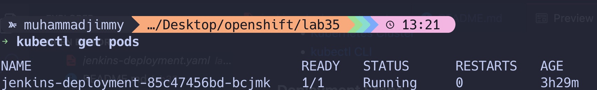
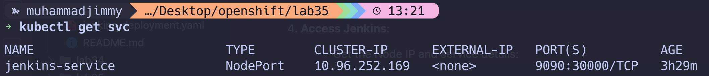

# Jenkins Deployment with Init Container

## 🚀 **Overview**

This repository provides Kubernetes configuration files to deploy a Jenkins application with the following features:

- **Init Container** that sleeps for 10 seconds before Jenkins starts.
- **Readiness and Liveness Probes** to ensure application health and readiness.
- **NodePort Service** to expose Jenkins outside the cluster.

---

## 🛠️ **Features**

### 1. **Init Container**

- The init container runs a `sleep` command for 10 seconds, ensuring dependencies or initial setup completes before Jenkins starts.

### 2. **Readiness and Liveness Probes**

- **Readiness Probe** checks if Jenkins is ready to serve traffic by testing the `/login` endpoint.
- **Liveness Probe** ensures Jenkins is running properly and restarts the container if it becomes unresponsive.

### 3. **NodePort Service**

- Exposes Jenkins on a `NodePort`, making it accessible externally on port `30008`.

---

## 📂 **Project Structure**

```plaintext
.
├── README.md                # Project documentation (this file)
├── jenkins-deployment.yaml  # Kubernetes YAML for Jenkins Deployment and Service
```

---

## 🚀 **Getting Started**

### Prerequisites

Ensure you have the following installed:

- [Kubernetes Cluster](https://kubernetes.io/docs/setup/)
- [kubectl CLI](https://kubernetes.io/docs/tasks/tools/install-kubectl/)

### Deployment Steps

1. **Apply the Deployment and Service YAML**:

   ```bash
   kubectl apply -f jenkins-deployment.yaml
   ```

2. **Verify Pod Status**:

   ```bash
   kubectl get pods
   ```

   Ensure the init container (`init-sleep`) runs successfully before the Jenkins container starts.
   

3. **Check Logs**:

   ```bash
   kubectl logs <jenkins-pod-name>
   ```

4. **Access Jenkins**:
   - Get the Node IP and service details:
     ```bash
     kubectl get svc
     ```
   - Open a browser and navigate to `http://<node-ip>:30008`.

---



## 🔍 **Key Concepts**

### 🕒 Init Container

An **init container** runs tasks required to initialize the application, such as waiting for dependencies or setting up configuration. In this deployment, the init container ensures a delay of 10 seconds before Jenkins starts.

### 🤝 Readiness vs. Liveness Probe

| **Aspect**  | **Readiness Probe**                                | **Liveness Probe**                              |
| ----------- | -------------------------------------------------- | ----------------------------------------------- |
| **Purpose** | Ensures the application is ready to serve traffic. | Ensures the application is healthy and running. |
| **Action**  | Marks the pod as `Ready` for traffic.              | Restarts the container if the probe fails.      |
| **Example** | Waits for Jenkins to load before serving users.    | Restarts Jenkins if it becomes unresponsive.    |

### 🔄 Init vs. Sidecar Container

| **Aspect**    | **Init Container**                                | **Sidecar Container**                                             |
| ------------- | ------------------------------------------------- | ----------------------------------------------------------------- |
| **Purpose**   | Runs once before the main container starts.       | Runs alongside the main container to provide auxiliary functions. |
| **Lifecycle** | Executes once and terminates.                     | Runs throughout the application’s lifetime.                       |
| **Example**   | Prepares configuration or waits for dependencies. | Handles logging, monitoring, or traffic proxying.                 |

---

## 🧪 **Validation**

1. Check that the init container executes successfully:

   ```bash
   kubectl describe pod <jenkins-pod-name>
   ```

   Look for the `init-sleep` container logs and status.

2. Ensure the readiness and liveness probes are functioning:

   ```bash
   kubectl describe pod <jenkins-pod-name>
   ```

   Verify the `Readiness` and `Liveness` probe events.

3. Access Jenkins via NodePort:
   - Navigate to `http://<node-ip>:30008` in your browser.

---

## 📘 **References**

- [Kubernetes Documentation](https://kubernetes.io/docs/)
- [Jenkins Docker Image](https://hub.docker.com/r/jenkins/jenkins)
- [Probes in Kubernetes](https://kubernetes.io/docs/tasks/configure-pod-container/configure-liveness-readiness-startup-probes/)

---

## 💡 **Future Enhancements**

- Add persistent storage for Jenkins data.
- Use a LoadBalancer service instead of NodePort.
- Automate deployment with Helm charts.

---

## 🎉 **Contributing**

Feel free to open issues or submit pull requests to improve this repository. Suggestions are always welcome!
