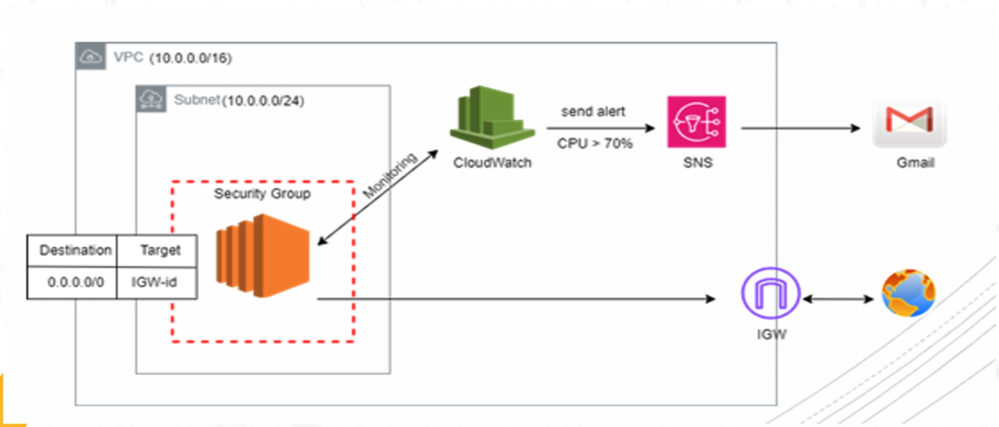

<h1>Remote Backend and LifeCycles Rules</h1>

```
Objective:
     - Implement the below diagram with Terraform.
     - Store state file in remote backend.
     - Use create_before_destroy Lifecycle on the EC2 and verify it. Compare between different Lifecycles Rules.

```



<!---Add Diagram img-->

> ## 1. Let's Start with the variables file (variables.tf)

```
Important Prerequisites:
        1.Ensure you have AWS credentials configured
        2.The S3 bucket mentioned in backend.tf already created
        3.The DynamoDB table for state locking created
```

```
# This file defines the input variables for your Terraform configuration:

variable "aws_region" {
  description = "AWS region"
  type        = string
  default     = "us-east-1"
}

variable "vpc_cidr" {
  description = "CIDR block for VPC"
  type        = string
  default     = "10.0.0.0/16"
}

variable "public_subnet_cidr" {
  description = "CIDR block for public subnet"
  type        = string
  default     = "10.0.1.0/24"
}

variable "private_subnet_cidr" {
  description = "CIDR block for private subnet"
  type        = string
  default     = "10.0.2.0/24"
}

variable "email_address" {
  description = "Email address for SNS notifications"
  type        = string
}

```

> ## 2. Then the terraform.tfvars

```
# This is a variable definitions file that sets specific values for the variables defined in your Terraform configuration:

aws_region         = "us-east-1"
vpc_cidr          = "10.0.0.0/16"
public_subnet_cidr = "10.0.1.0/24"
private_subnet_cidr = "10.0.2.0/24"
email_address      = "mgghatory@gmail.com"

```

> ## 3. Now we will create a remote backend terraform state file

```
# This configuration sets up a remote backend for storing Terraform state files.
# This bucket must exist before applying the configuration
# Uses DynamoDB for state locking
# Prevents multiple users from modifying infrastructure simultaneously
# The table must exist before applying the configuration

terraform {
  backend "s3" {
    bucket         = "ivolve-mg-terraform-state"
    key            = "terraform.tfstate"
    region         = "us-east-1"
    encrypt        = true
    dynamodb_table = "terraform-state-lock"
  }
}

```

> ## 4. The main.tf file is the file which contains the core infrastructure configuration

```

# VPC
resource "aws_vpc" "main" {
  cidr_block           = var.vpc_cidr
  enable_dns_hostnames = true
  enable_dns_support   = true

  tags = {
    Name = "main-vpc"
  }
}

# Internet Gateway
resource "aws_internet_gateway" "main" {
  vpc_id = aws_vpc.main.id

  tags = {
    Name = "main-igw"
  }
}

# Public Subnet
resource "aws_subnet" "public" {
  vpc_id                  = aws_vpc.main.id
  cidr_block             = var.public_subnet_cidr
  map_public_ip_on_launch = true
  availability_zone       = "${var.aws_region}a"

  tags = {
    Name = "public-subnet"
  }
}

# Private Subnet
resource "aws_subnet" "private" {
  vpc_id            = aws_vpc.main.id
  cidr_block        = var.private_subnet_cidr
  availability_zone = "${var.aws_region}a"

  tags = {
    Name = "private-subnet"
  }
}

# Public Route Table
resource "aws_route_table" "public" {
  vpc_id = aws_vpc.main.id

  route {
    cidr_block = "0.0.0.0/0"
    gateway_id = aws_internet_gateway.main.id
  }

  tags = {
    Name = "public-rt"
  }
}

# Public Route Table Association
resource "aws_route_table_association" "public" {
  subnet_id      = aws_subnet.public.id
  route_table_id = aws_route_table.public.id
}

# Security Group for EC2
resource "aws_security_group" "ec2" {
  name        = "ec2-security-group"
  description = "Security group for EC2 instance"
  vpc_id      = aws_vpc.main.id

  ingress {
    from_port   = 22
    to_port     = 22
    protocol    = "tcp"
    cidr_blocks = ["0.0.0.0/0"]
  }

  egress {
    from_port   = 0
    to_port     = 0
    protocol    = "-1"
    cidr_blocks = ["0.0.0.0/0"]
  }

  tags = {
    Name = "ec2-sg"
  }
}

# SNS Topic
resource "aws_sns_topic" "cpu_alert" {
  name = "cpu-alert-topic"
}

# SNS Topic Subscription
resource "aws_sns_topic_subscription" "cpu_alert_email" {
  topic_arn = aws_sns_topic.cpu_alert.arn
  protocol  = "email"
  endpoint  = var.email_address
}

# CloudWatch Alarm
resource "aws_cloudwatch_metric_alarm" "cpu_alarm" {
  alarm_name          = "cpu-utilization"
  comparison_operator = "GreaterThanThreshold"
  evaluation_periods  = "2"
  metric_name         = "CPUUtilization"
  namespace           = "AWS/EC2"
  period              = "300"
  statistic           = "Average"
  threshold           = "70"
  alarm_description   = "This metric monitors EC2 CPU utilization"
  alarm_actions       = [aws_sns_topic.cpu_alert.arn]

  dimensions = {
    InstanceId = aws_instance.example.id
  }
}

# EC2 Instance
resource "aws_instance" "example" {
  ami           = "ami-0e2c8caa4b6378d8c" # Replace with your desired AMI
  instance_type = "t2.micro"
  subnet_id     = aws_subnet.public.id
  vpc_security_group_ids = [aws_security_group.ec2.id]

  tags = {
    Name = "example-instance"
  }

  lifecycle {
    create_before_destroy = true
  }
}

```

> ## 5. Steps to apply this Terraform Configuration

```
# 1. First, initialize Terraform
    - terraform init

# 2. Validate your configuration files:
    - terraform plan

# 3. Apply the configuration:
    - terraform apply
```
