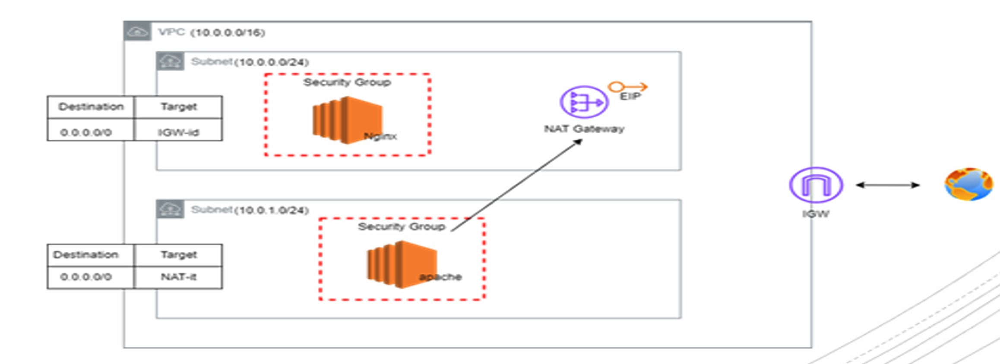

<h1>Terraform Variables and Loops</h1>

```
Objective:
        - Implement the below diagram with Terraform using variables for all arguments.
        - do not repeat code.
        - Install Nginx, Apache using remote provisioner.
        - Create the VPC  manually then make terraform manage it ‘Terraform import’.
        - Output public ip and private ip of EC2s.

```



<!--add diagram img-->

> ## 1. First Let's start with Variables File (variables.tf)

```
# Create File named variables.tf
# We will use variables , locals , and dynamic blocks to reduce code duplication

variable "aws_region" {
  default = "us-east-1"
}

variable "vpc_id" {
  type = string
}

variable "key_pair_name" {
  type = string
}

variable "common_tags" {
  type = map(string)
  default = {
    Environment = "dev"
    Terraform   = "true"
  }
}

variable "subnets" {
  type = list(object({
    name               = string
    cidr_block         = string
    availability_zone  = string
    is_public         = bool
  }))
  default = [
    {
      name              = "public"
      cidr_block       = "10.0.1.0/24"
      availability_zone = "us-east-1a"
      is_public        = true
    },
    {
      name              = "private"
      cidr_block       = "10.0.2.0/24"
      availability_zone = "us-east-1a"
      is_public        = false
    }
  ]
}

variable "route_tables" {
  type = list(object({
    name = string
    routes = list(object({
      cidr_block   = string
      gateway_key  = string
    }))
  }))
  default = [
    {
      name = "public-rt"
      routes = [
        {
          cidr_block  = "0.0.0.0/0"
          gateway_key = "igw"
        }
      ]
    },
    {
      name = "private-rt"
      routes = [
        {
          cidr_block  = "0.0.0.0/0"
          gateway_key = "nat"
        }
      ]
    }
  ]
}

variable "instances" {
  type = list(object({
    name       = string
    subnet_key = string
    user_data  = string
  }))
  default = [
    {
      name       = "nginx-server"
      subnet_key = "public"
      user_data  = <<-EOF
                   #!/bin/bash
                   yum update -y
                   yum install nginx -y
                   systemctl start nginx
                   systemctl enable nginx
                   EOF
    },
    {
      name       = "apache-server"
      subnet_key = "private"
      user_data  = <<-EOF
                   #!/bin/bash
                   yum update -y
                   yum install httpd -y
                   systemctl start httpd
                   systemctl enable httpd
                   EOF
    }
  ]
}

variable "security_group_rules" {
  type = list(object({
    type        = string
    from_port   = number
    to_port     = number
    protocol    = string
    cidr_blocks = list(string)
  }))
  default = [
    {
      type        = "ingress"
      from_port   = 80
      to_port     = 80
      protocol    = "tcp"
      cidr_blocks = ["0.0.0.0/0"]
    },
    {
      type        = "ingress"
      from_port   = 22
      to_port     = 22
      protocol    = "tcp"
      cidr_blocks = ["0.0.0.0/0"]
    },
    {
      type        = "egress"
      from_port   = 0
      to_port     = 0
      protocol    = "-1"
      cidr_blocks = ["0.0.0.0/0"]
    }
  ]
}

```

> ## 2. Second we will create the main.tf file

```
provider "aws" {
  region = var.aws_region
}

locals {
  subnet_map = { for subnet in aws_subnet.main : subnet.tags["Name"] => subnet.id }
  gateway_map = {
    igw = aws_internet_gateway.main.id
    nat = aws_nat_gateway.main.id
  }
}

resource "aws_vpc" "existing" {
  # Configuration will be imported
}

resource "aws_internet_gateway" "main" {
  vpc_id = aws_vpc.existing.id
  tags   = merge(var.common_tags, { Name = "main-igw" })
}

resource "aws_subnet" "main" {
  count                   = length(var.subnets)
  vpc_id                  = aws_vpc.existing.id
  cidr_block             = var.subnets[count.index].cidr_block
  availability_zone      = var.subnets[count.index].availability_zone
  map_public_ip_on_launch = var.subnets[count.index].is_public

  tags = merge(var.common_tags, {
    Name = "${var.subnets[count.index].name}-subnet"
  })
}

resource "aws_eip" "nat" {
  domain = "vpc"
  tags   = merge(var.common_tags, { Name = "nat-eip" })
}

resource "aws_nat_gateway" "main" {
  allocation_id = aws_eip.nat.id
  subnet_id     = local.subnet_map["public-subnet"]
  tags          = merge(var.common_tags, { Name = "main-nat" })
}

resource "aws_route_table" "main" {
  count  = length(var.route_tables)
  vpc_id = aws_vpc.existing.id

  dynamic "route" {
    for_each = var.route_tables[count.index].routes
    content {
      cidr_block     = route.value.cidr_block
      gateway_id     = route.value.gateway_key == "igw" ? local.gateway_map["igw"] : null
      nat_gateway_id = route.value.gateway_key == "nat" ? local.gateway_map["nat"] : null
    }
  }

  tags = merge(var.common_tags, {
    Name = var.route_tables[count.index].name
  })
}

resource "aws_route_table_association" "main" {
  count          = length(var.subnets)
  subnet_id      = aws_subnet.main[count.index].id
  route_table_id = aws_route_table.main[var.subnets[count.index].is_public ? 0 : 1].id
}

resource "aws_security_group" "common" {
  name        = "common-sg"
  description = "Common security group for EC2 instances"
  vpc_id      = aws_vpc.existing.id

  dynamic "ingress" {
    for_each = [for rule in var.security_group_rules : rule if rule.type == "ingress"]
    content {
      from_port   = ingress.value.from_port
      to_port     = ingress.value.to_port
      protocol    = ingress.value.protocol
      cidr_blocks = ingress.value.cidr_blocks
    }
  }

  dynamic "egress" {
    for_each = [for rule in var.security_group_rules : rule if rule.type == "egress"]
    content {
      from_port   = egress.value.from_port
      to_port     = egress.value.to_port
      protocol    = egress.value.protocol
      cidr_blocks = egress.value.cidr_blocks
    }
  }

  tags = merge(var.common_tags, { Name = "common-sg" })
}

resource "aws_instance" "main" {
  count                  = length(var.instances)
  ami                    = "ami-0453ec754f44f9a4a"  # Replace with your AMI
  instance_type         = "t2.micro"
  subnet_id             = local.subnet_map["${var.instances[count.index].subnet_key}-subnet"]
  key_name              = var.key_pair_name
  vpc_security_group_ids = [aws_security_group.common.id]
  user_data             = var.instances[count.index].user_data

  tags = merge(var.common_tags, {
    Name = var.instances[count.index].name
  })
}

```

> ## 3. After that the output file

```
output "instance_ips" {
  value = {
    for instance in aws_instance.main :
    instance.tags["Name"] => {
      private_ip = instance.private_ip
      public_ip  = instance.public_ip
    }
  }
}

output "nat_gateway_ip" {
  value = aws_eip.nat.public_ip
}

```

> ## 4. Finally the terraform.tfvars file

```
vpc_id        = "vpc-01d2e14b8b1ee0d30"    # Your VPC ID
key_pair_name = "ansible-ec2"   # Your key pair name inside aws console

common_tags = {
  Environment = "dev"
  Project     = "demo"
  Terraform   = "true"
}

```

> ## 5. Applying this configuration

```
# 1.Update the AMI ID in the instance resource
# 2.Set your VPC ID and key pair name in terraform.tfvars
# 3.Adjust the CIDR blocks and availability zones as needed
# Run:
    terraform init
    terraform import aws_vpc.existing vpc-xxxxxxxx
    terraform apply
```

## - Terraform init


## - Terraform import vpc


## - Terraform apply & Output


<!---Add screenshots here-->

## > After applying this configuration we managed to:

    1- Move all configurations to variables
    2- Common tags applied consistently across resources
    3- Dynamic blocks for security group rules
    4- Subnet and gateway mapping using locals
    5- Consolidated route table associations
    6- Instance configurations defined in variables
    7- More flexible and maintainable outputs
    8- Reduced repetition in resource configurations

# > Conclusion

<h3>This configuration is more maintainable and easier to modify since most changes can be made through variables rather than changing the main configuration.</h3>
