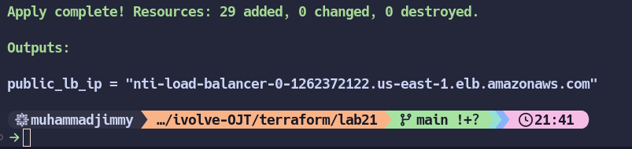

<h1>Terraform Workspace</h1>

```
• Create new Workspace called ivolve.
• Implement the below diagram with Terraform using Modules.
• Output public LB IP, screenshot when try to access public LB.
• Try not to repeat any code

```
<!--add diagram img-->


> ## 1. First, we will start with Variables File

```
# This code block contains Terraform variable declarations that are typically used for AWS infrastructure configuration.

# providers variables 
variable "profile" {}
variable "region" {}

# vpc module  variables
variable "vpc_cidr"{}

# subnet module variables
variable "pub_subnet"{
    type              = list(object({
    subnets_cidr      = string
    availability_zone = string
  }))
}

variable "priv_subnet"{
    type              = list(object({
    subnets_cidr      = string
    availability_zone = string
  }))
}

# loadbalancer module variables
variable "lb_internal"{}
```

> ## 2. Now let's create the terraform.tfvars file

```
# This is a Terraform .tfvars file that contains actual values for variables used in your Terraform configuration. 
# This configuration creates a highly available architecture across two availability zones with both public and private subnets, which is a common pattern for production workloads in AWS.


# providers values 
profile  = "default"
region   = "us-east-1"

# vpc module values
vpc_cidr = "10.0.0.0/16"

# subnet  module values
pub_subnet = [
    { subnets_cidr      = "10.0.0.0/24"
      availability_zone = "us-east-1a" },
    { subnets_cidr      = "10.0.2.0/24"
      availability_zone = "us-east-1b"}
]

priv_subnet = [
    { subnets_cidr      = "10.0.1.0/24"
      availability_zone = "us-east-1a"},
    { subnets_cidr      = "10.0.3.0/24"
     availability_zone  = "us-east-1b" }
]

# loadbalancer  module values
lb_internal = [false,true]
```

> ## 3. Now let's Move to main infrastructure file using modules

```
# This Terraform configuration file shows the main infrastructure setup using multiple modules.

provider "aws" {
  profile = var.profile
  region  = var.region
}

module "vpc" {
  source        = "./modules/vpc"
  vpc_cidr      = var.vpc_cidr
  nat_subnet_id = module.subnet.public_subnets_id[0]
}

module "subnet" {
  source       = "./modules/subnet"
  vpc_id       = module.vpc.vpc_id
  pub_subnets  = var.pub_subnet
  priv_subnets = var.priv_subnet
  igw_id       = module.vpc.igw_id
  nat_id       = module.vpc.nat_id
}

module "loadbalancer" {
  source         = "./modules/loadbalancer"
  lb_vpc_id      = module.vpc.vpc_id
  pub_target_id  = module.ec2.public_ec2_id
  priv_target_id = module.ec2.private_ec2_id
  lb_internal    = var.lb_internal
  lb_subnets     = [module.subnet.public_subnets_id,module.subnet.private_subnets_id]                   
  lb_sg_id       = module.ec2.security_group_id
}

module "ec2" {
  source                = "./modules/ec2"
  sg_vpc_id             = module.vpc.vpc_id
  priv_lb_dns           = module.loadbalancer.private_load_balancer_dns
  ec2_public_subnet_id  = module.subnet.public_subnets_id
  ec2_private_subnet_id = module.subnet.private_subnets_id
}

output "public_lb_ip" {
    value = module.loadbalancer.public_load_balancer_dns
}

```

> ## 4. After that we will make the Terraform Backend file 

```
# This setup is crucial for team environments because it:

   - Enables collaboration (multiple team members can access the same state)

   - Prevents concurrent modifications (state locking)

   - Keeps state history (S3 versioning)

   - Secures sensitive information (encryption)


# Steps of setting up and applying this remote backend configuration

    1. First, Create S3 Bucket (Manually via Console):

       - Go to S3 in AWS Console

       - Click "Create bucket"

       - Choose a globally unique name (e.g., "terraform-state-yourname-123")

       - Select your desired region

       - Enable versioning

       - Keep other settings as default

       - Click "Create bucket"

    2. Create DynamoDB Table (Manually via Console):

       - Go to DynamoDB in AWS Console

       - Click "Create table"

       - Table name: e.g., "terraform-state-lock"

       - Partition key: "LockID" (must be exactly this name, type: String)

       - Use default settings

       - Click "Create table"

    3. Create Backend Configuration: Create a new file named backend.tf:

terraform {
  backend "s3" {
    bucket         = "XXXXXXXXXXXXXXXXXXXXXXXXX"
    key            = "terraform-tfstate"
    region         = "us-east-1"
    dynamodb_table = "terraform-state-lock"
    encrypt        = true
  }
}


```

> ## 5. Let's Create a new workspace called ivolve

```
1. First, check current workspaces:

    terraform workspace list

2. Create and switch to new workspace:

    terraform workspace new ivolve

3. Verify you're in the correct workspace:

    terraform workspace show
    # Should output: ivolve

4. Modify your backend configuration ( backend.tf) to include workspace name in the state file path:

terraform {
  backend "s3" {
    bucket = "ivolve-remote-backend"
    key    = "ivolve/terraform-tfstate"
    region = "us-east-1"
    dynamodb_table = "terraform-state-lock"
    encrypt        = true
  }
}


```

> ## 6. EC2 Resources Module

```
# This Terraform code defines resources for EC2 instances and their security group.


# CREATE AMI TO BE USED IN EC2
data "aws_ami" "ubuntu" {
  most_recent = true

  filter {
    name   = "name"
    values = ["ubuntu/images/hvm-ssd/ubuntu-focal-20.04-amd64-server-*"]
  }

  filter {
    name   = "virtualization-type"
    values = ["hvm"]
  }

  filter {
    name   = "architecture"
    values = ["x86_64"]
  }
  owners = ["099720109477"]
}

# CREATE A SECURITY GROUP
resource "aws_security_group" "sg" {
  vpc_id = var.sg_vpc_id

  ingress {
    from_port   = 443
    to_port     = 443
    protocol    = "tcp"
    cidr_blocks = ["0.0.0.0/0"]
  }
  
  ingress {
    from_port   = 80
    to_port     = 80
    protocol    = "tcp"
    cidr_blocks = ["0.0.0.0/0"]
  }

  ingress {
    from_port   = 22
    to_port     = 22
    protocol    = "tcp"
    cidr_blocks = ["0.0.0.0/0"]
  }

  egress {
    from_port   = 0
    to_port     = 0
    protocol    = "-1"
    cidr_blocks = ["0.0.0.0/0"]
  }

  tags = {
    Name = "NTI_sg"
  }
}

# LAUNCHE PUBLIC EC2 INSTANCES
resource "aws_instance" "pub-ec2" {
  count                       = length(var.ec2_public_subnet_id) 
  ami                         = data.aws_ami.ubuntu.id
  instance_type               = "t2.micro"
  subnet_id                   = var.ec2_public_subnet_id[count.index]    
  security_groups             = [aws_security_group.sg.id]
  associate_public_ip_address = true
  tags = {
      Name = "nti_public_ec2_${count.index}"
    } 

    user_data = <<EOF
#!/bin/bash
sudo apt-get update
sudo apt-get install -y nginx
sudo systemctl start nginx
sudo systemctl enable nginx
sudo cat > /etc/nginx/sites-enabled/default << EOL
server {
    listen 80 default_server;
    location / {
      proxy_pass http://${var.priv_lb_dns};
    }
}
  
EOL
sudo systemctl restart nginx
EOF

  provisioner "local-exec" {
    when        = create
    on_failure  = continue
    command = "echo public-ip-${count.index} : ${self.private_ip} >> all-ips.txt"
 }
}

# LAUNCHE PRIVATE EC2 INSTANCES
resource "aws_instance" "priv-ec2" {
  count                       = length(var.ec2_private_subnet_id) 
  ami                         = data.aws_ami.ubuntu.id
  instance_type               = "t2.micro"
  subnet_id                   = var.ec2_private_subnet_id[count.index]    
  security_groups             = [aws_security_group.sg.id]
  associate_public_ip_address = false
  
  tags = {
    Name = "nti_private_ec2_${count.index}"  
  }
    user_data = <<EOF
#!/bin/bash
sudo apt-get update
sudo apt-get install -y apache2
sudo systemctl start apache2
sudo systemctl enable apache2
systemctl restart apache2
EOF

  provisioner "local-exec" {
    when        = create
    on_failure  = continue
    command = "echo private-ip-${count.index} : ${self.private_ip} >> all-ips.txt"
 }
}

```

> ## 6.1 EC2 Module Vars file

```
# This Terraform variables file ( vars.tf) defines input variables for an EC2 module.


# VARIABLE TO GET THE VPC ID TO BE USED IN SECURITY GROUP
variable "sg_vpc_id"{
  type = string
}

# variable used in nginx script to proxy to the private load balancer
variable "priv_lb_dns" {} 

# VARIABLE TO CREATE 1 INSTANCE IN EACH PUBLIC SUBNET
variable "ec2_public_subnet_id" {
  type = list
}


# VARIABLE TO CREATE 1 INSTANCE IN EACH PRIVATE SUBNET
variable "ec2_private_subnet_id" {
  type = list
}

```

> ## 6.2 EC2 Module Output file

```
# This Terraform outputs file ( outputs.tf) defines three output values that can be referenced by other modules or shown after applying the configuration

# These outputs are particularly useful when:

   - Setting up load balancer target groups

   - Configuring security group associations

   - Reference EC2 instances in other parts of your infrastructure


# OUTPUT TO RETRIVE ALL PUBLIC INSTANCES IP
output "public_ec2_id" {
  value = aws_instance.pub-ec2[*].id
}

# OUTPUT TO RETRIVE ALL PRIVATE INSTANCES IP
output "private_ec2_id" {
  value = aws_instance.priv-ec2[*].id
}

# OUTPUT TO RETRIVE SECURITY GROUP ID TO BE USED IN LOAD BALANCER 
output "security_group_id" {
    value = aws_security_group.sg.id
}

```

> ## 7. Loadbalancer Module variable file

```
# This Terraform variables file ( vars.tf) defines input variables for a load balancer module. 

# VARIABLES NEEDED IN TARGET GROUPS
variable "lb_vpc_id"{
    type = string
}
# VARIABLES NEEDED IN PUBLIC TARGET GROUP ATTACHMENT
variable "pub_target_id"{
    type = list(string)
}

# VARIABLES NEEDED IN PRIVATE TARGET GROUP ATTACHMENT
variable "priv_target_id"{
    type = list(string)
}

# VARIABLES NEEDED IN LOAD BALANCER
variable "lb_internal"{
    type = list(bool)
}

# list of [list of public subnets , list of private subnets]
variable "lb_subnets"{
    type = list(list(string))
}

variable "lb_sg_id"{}

```

> ## 7.1  Loadbalancer Module Resources file

```
# This Terraform code ( resources.tf) creates load balancers and target groups

# CREATE 2 TARGET GROUP FOR PUBLIC AND PRIVATE SUBNETS
resource "aws_lb_target_group" "tg" {
    count    = 2
    port     = 80
    protocol = "HTTP"   
    vpc_id   = var.lb_vpc_id
}

# ATTACHE TARGET GROUP TO PUBLIC SUBNETS
resource "aws_lb_target_group_attachment" "public-target-group-attachment" {
    count            = length(var.pub_target_id)
    target_group_arn = aws_lb_target_group.tg[0].arn
    target_id        = var.pub_target_id[count.index]
    port             = 80
}

# ATTACHE TARGET GROUP TO PRIVATE SUBNETS
resource "aws_lb_target_group_attachment" "private-target-group-attachment" {
    count            = length(var.priv_target_id)
    target_group_arn = aws_lb_target_group.tg[1].arn
    target_id        = var.priv_target_id[count.index]
    port             = 80
}

# CREATE PUBLIC & PRIVATE LOAD BALANCER
resource "aws_lb" "load-balancer" {
    count                      = 2
    name                       = "nti-load-balancer-${count.index}"
    internal                   = var.lb_internal[count.index]
    load_balancer_type         = "application"
    subnets                    = var.lb_subnets[count.index]     
    security_groups            = [var.lb_sg_id]
    # enable_deletion_protection = true
}
# CREATE 2 LOAD BALANCER LISTNERS
resource "aws_lb_listener" "lb-listner" {
    count             = 2
    load_balancer_arn = aws_lb.load-balancer[count.index].id
    port              = "80"
    protocol          = "HTTP"
    default_action {
        type  = "forward"
        target_group_arn = aws_lb_target_group.tg[count.index].id
  }
}

```

> ## 7.2 Loadbalancer Module output file

```
# This Terraform outputs file ( outputs.tf) defines two output values related to load balancer DNS names

# OUTPUT TO RETRIVE THE PUBLIC LOAD BALANCER DNS
output "public_load_balancer_dns" {
  value = aws_lb.load-balancer[0].dns_name
} 

# OUTPUT TO RETRIVE THE PRIVATE LOAD BALANCER DNS
output "private_load_balancer_dns" {
    value = aws_lb.load-balancer[1].dns_name
}

```

> ## 8 Subnet Module variable file 

```
# This Terraform variables file ( vars.tf) defines input variables for a subnet module.


#Subnet Variables
variable "vpc_id"{
    description = "ID of the vpc in where the subnets will be"
    type        = string
}

variable "pub_subnets"{
  description = "public subnets info"
  type        = list(object({
    subnets_cidr      = string
    availability_zone = string
  }))
}

variable "igw_id"{
    description = "ID of the IGW to be used in route table for public subnets"
    type = string
}

variable "priv_subnets"{
description = "private subnets info"
  type = list(object({
    subnets_cidr = string
    availability_zone = string
  }))
}

variable "nat_id"{
    description = "ID of the NAT to be used in route table for private subnets"
    type = string
}


# This configuration enables:

   - Creation of both public and private subnets

   - High availability across multiple availability zones

   - Proper network routing through IGW and NAT

   - Flexible subnet sizing with CIDR blocks
```

> ## 8.1 Subnet Module resource file 

```
# This Terraform code ( resources.tf) creates subnets and their associated route tables


# CREATE PUBLIC SUBNETS
resource "aws_subnet" "public_subnets" {
  count             = length(var.pub_subnets)
  vpc_id            = var.vpc_id
  cidr_block        = var.pub_subnets[count.index].subnets_cidr
  availability_zone = var.pub_subnets[count.index].availability_zone
  tags = {
    Name = "nti_public_subnet_${count.index}"
  }
}

# CREATE PUBLIC ROUTE TABLE 
resource "aws_route_table" "public-rt" {
  vpc_id = var.vpc_id
  route {
    cidr_block = "0.0.0.0/0"
    gateway_id = var.igw_id
  }
}

# ASSIGN THE PUBLIC ROUTE TABLE TO ALL PUBLIC SUBNETS
resource "aws_route_table_association" "public-rta" {
  count          = length(aws_subnet.public_subnets)
  subnet_id      = aws_subnet.public_subnets[count.index].id
  route_table_id = aws_route_table.public-rt.id
}

# CREATE PRIVATE SUBNETS
resource "aws_subnet" "private_subnets" {
  count             = length(var.priv_subnets)
  vpc_id            = var.vpc_id
  cidr_block        = var.priv_subnets[count.index].subnets_cidr
  availability_zone = var.priv_subnets[count.index].availability_zone
  tags = {
    Name = "nti_private_subnet_${count.index}"
  }
}
# CREATE PRIVATE ROUTE TABLE 
resource "aws_route_table" "private-rt" {
  vpc_id = var.vpc_id
  route {
    cidr_block     = "0.0.0.0/0"
    nat_gateway_id = var.nat_id
  }
}

# ASSIGN THE PRIVATE ROUTE TABLE TO ALL PRIVATE SUBNETS
resource "aws_route_table_association" "private-rta" {
  count          = length(aws_subnet.private_subnets)
  subnet_id      = aws_subnet.private_subnets[count.index].id   
  route_table_id = aws_route_table.private-rt.id
}


# This creates a typical network architecture where:

   - Public subnets can directly access/receive from internet

   - Private subnets can only access internet through NAT

   - Resources are distributed across availability zones for high availability
```

> ## 8.2 Subent module output file

```
# This Terraform outputs file ( outputs.tf) defines two output values for subnet IDs.


# OUTPU TO RETRIVE ALL PUBLIC SUBNETS ID
output "public_subnets_id" {
    value = aws_subnet.public_subnets[*].id
}

# OUTPU TO RETRIVE ALL PUBLIC SUBNETS ID
output "private_subnets_id" {
    value = aws_subnet.private_subnets[*].id
}


# These outputs are commonly used for:

   - Launching EC2 instances in specific subnets

   - Configuring load balancers

   - Setting up RDS instances

   - Any other resources that need to be placed in specific subnets

The [*] splat expression ensures you get all subnet IDs even when multiple subnets are created using count.
```

> ## 9. VPC Module Variable file

```
# This Terraform variables file ( vars.tf) defines two variables for a VPC module. 

# VPC VARIALES
variable "vpc_cidr" { 
    description = "VPC CIDR"
    type = string 
    }
# NAT VARIABLES
variable "nat_subnet_id"{
    description = "The subnet ID of the public subnet in which to place the gateway"
    type = string


# These variables are used for:

   - Creating the VPC with proper IP range

   - Placing the NAT Gateway in the correct public subnet

   - Ensuring proper network architecture and connectivity

The values for these variables would typically be provided when calling the VPC module from the root module.
```

> ## 9.1 VPC Module Resources File

```
# This Terraform code ( resources.tf) creates core VPC infrastructure components. 


# CREATE A VPC
resource "aws_vpc" "vpc" {
  cidr_block = var.vpc_cidr
  tags = {
    Name = "NTI-VPC"
  }
}

# CREATE AN INTERNET GATEWAY
resource "aws_internet_gateway" "igw" {
  vpc_id = aws_vpc.vpc.id
  tags = {
    Name = "NTI-IGW"
  }
}


# CREATE ELASTIC IP
resource "aws_eip" "eip" {
  domain   = "vpc"
}

# CREATE NAT IN THE FIRST PUBLIC SUBNET
resource "aws_nat_gateway" "nat" {
  allocation_id = aws_eip.eip.id
  subnet_id     = var.nat_subnet_id
  tags = {
    Name = "nti-NAT"
  }
  # To ensure proper ordering, i will add an explicit dependency on the Internet Gateway.
  depends_on = [aws_internet_gateway.igw]
}


# This creates a typical VPC architecture where:

   - Public resources can directly access internet via IGW

   - Private resources can access internet via NAT Gateway

   - All components are properly tagged for identification

   - Dependencies are explicitly managed for proper deployment
```

> ## 9.2 VPC Module Output file 

```
# This Terraform outputs file ( outputs.tf) defines three output values from the VPC module.


# OUTPUT TO RETRIVE VPC ID
output "vpc_id" {
    value = aws_vpc.vpc.id
}

# OUTPUT TO RETRIVE INTERNET GATEWAY ID
output "igw_id" {
    value = aws_internet_gateway.igw.id
}

#OUTPUT TO RETRIVE NAT ID
output "nat_id" {
    value = aws_nat_gateway.nat.id
}

```

> ## 10. Finally Let's Apply this Configuration 
    Important Notes Before Applying:

       - Ensure AWS credentials are configured (via AWS CLI or environment variables)

       - Make sure you're in the correct AWS region

       - Double-check all CIDR ranges before applying

       - Review the plan output carefully before applying

```
# Initialize Terraform (only needed once)
terraform init

# See planned changes
terraform plan

# Apply the configuration
terraform apply

```
> ## 11. Verifying the configuration 



<h2>let's try accessing this loadbalancer via Web Browser</h2>


# !!! It Works !!!